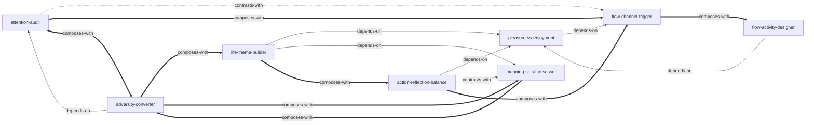

# flow-skills

由《心流：最优体验心理学》蒸馏出的一组**可被 AI Agent 调用的技能**（Skills）。

> 幸福不能直接追求——它是你全身心投入一件有挑战性的活动时，作为副产品自然涌现的。
> 本书把这种最优心理状态命名为「心流」，并给出了一套可操作的方法论。
> 本项目把这些方法论提炼成 8 个原子化技能，让 Agent 能在真实场景里调用它们。

---

## 来源

| | |
|---|---|
| **书名** | 心流：最优体验心理学（*Flow: The Psychology of Optimal Experience*） |
| **作者** | 米哈里·契克森米哈赖（Mihaly Csikszentmihalyi） |
| **出版** | 1990（英文原版）/ 2017（中信出版社中文版） |
| **蒸馏工具** | cangjie-skill（仓颉：把长内容蒸馏成可调用技能的流水线） |
| **蒸馏方法** | RIA-TV++（整书理解 → 并行提取 → 三重验证 → RIA++ 构造 → 链接 → 压力测试 → 交付） |

---

## 8 个技能

### 心流诊断与触发

- [`flow-channel-trigger`](skills/flow-channel-trigger/SKILL.md) — **心流触发器**：诊断活动的挑战-技巧比例，调整进入「无聊与焦虑之间」的心流通道
- [`pleasure-vs-enjoyment`](skills/pleasure-vs-enjoyment/SKILL.md) — **享乐乐趣辨别器**：区分恢复均衡型「享乐」与成长型「乐趣」，评估活动品质
- [`flow-activity-designer`](skills/flow-activity-designer/SKILL.md) — **心流活动设计器**：为无聊/重复性活动注入目标、规则、反馈、难度四要素

### 意识管理

- [`attention-audit`](skills/attention-audit/SKILL.md) — **注意力审计**：诊断注意力带宽分配，识别「精神熵」来源并重新分配

### 逆境与成长

- [`adversity-converter`](skills/adversity-converter/SKILL.md) — **逆境转换器**：把精神熵（打击/压力/创伤）转化为内在秩序（目标/挑战/成长）

### 人生意义

- [`life-theme-builder`](skills/life-theme-builder/SKILL.md) — **人生主题构建器**：从分散目标中提炼统一人生主题，赋予整体生命意义
- [`meaning-spiral-assessor`](skills/meaning-spiral-assessor/SKILL.md) — **意义螺旋评估器**：评估当前意义发展阶段（求生→社群→个人主义→超越），判断是否该前进
- [`action-reflection-balance`](skills/action-reflection-balance/SKILL.md) — **行动反省平衡法**：投入大目标前的五问自检，平衡「行动式」与「反省式」两种生活

---

## 技能之间的引用关系



图例：`-->` 依赖 · `-.->` 二选一 · `===>` 常配合使用

**推荐学习顺序**（从叶子节点向上）：`pleasure-vs-enjoyment` → `flow-channel-trigger` → `attention-audit` → `flow-activity-designer` → `adversity-converter` → `meaning-spiral-assessor` → `life-theme-builder` → `action-reflection-balance`

---

## 安装

每个技能目录都包含 `SKILL.md`（+ `test-prompts.json` / `test-results.md` 测试产物），可直接复制到宿主环境：

```bash
# Claude Code（用户级，所有项目可用）
cp -r skills/* ~/.claude/skills/

# 或 Claude Code（项目级）
cp -r skills/* <project>/.claude/skills/

# Trae（项目级）
cp -r skills/* <project>/.trae/skills/

# Cursor（项目级）
cp -r skills/* <project>/.cursor/skills/
```

---

## 完整文档

`docs/` 目录保留了完整的蒸馏产物与审计轨迹：

| 文件 | 说明 |
|---|---|
| [`DIGEST.md`](docs/DIGEST.md) | 面向读者的精华长文（不读全书看这篇，约 6000 字） |
| [`GLOSSARY.md`](docs/GLOSSARY.md) | 14 个共享术语词典（心流/精神熵/注意力/享乐/乐趣…） |
| [`INDEX.md`](docs/INDEX.md) | 技能总览 + 引用图 + 学习顺序 |
| [`BOOK_OVERVIEW.md`](docs/BOOK_OVERVIEW.md) | 整书理解（结构/解释/批判/应用潜力） |
| [`verified.md`](docs/verified.md) | 三重验证结果（64 候选 → 8 通过） |
| [`PIPELINE_STATE.md`](docs/PIPELINE_STATE.md) | 流水线各阶段状态 |
| [`TEST_RESULTS.md`](docs/TEST_RESULTS.md) | 压力测试汇总（总通过率 94.8%） |
| [`candidates/`](docs/candidates/) | 5 个提取器的原始候选池 |

---

## 目录结构

```text
flow-skills/
├── README.md
├── skills/                      # 8 个可安装技能（核心交付物）
│   └── <skill-slug>/
│       ├── SKILL.md             # 技能定义（R/I/A1/A2/E/B 六段）
│       ├── test-prompts.json    # 触发/诱饵测试集
│       └── test-results.md      # 压力测试结果
└── docs/                        # 蒸馏文档与审计轨迹
    ├── DIGEST.md / GLOSSARY.md / INDEX.md
    ├── BOOK_OVERVIEW.md / verified.md / PIPELINE_STATE.md
    ├── TEST_RESULTS.md / blind-test-prompts.txt
    └── candidates/              # 框架/原则/案例/反例/术语 候选池
```

---

## 关于内容与版权

本项目是**方法论蒸馏产物**，不含原书全文：

- 每个技能对原书的引用严格控制在 **≤150 字/段**，属于合理引用范畴；
- 原文的版权归原作者米哈里·契克森米哈赖及中信出版社所有；
- 建议购买正版书籍配合使用。

---

## 如何重新生成

本项目由 cangjie-skill（仓颉蒸馏流水线）自动生成。若要复现或调整：

1. 准备书籍文本（`fulltext.txt`，从 EPUB 提取）
2. 运行 RIA-TV++ 流水线（阶段 0–5，详见 `docs/PIPELINE_STATE.md`）
3. 通过三重验证 + 压力测试的单元会被构造为独立技能并安装

如需让技能持续进化，可喂给 `darwin-skill`：`darwin evolve flow-skills/`
