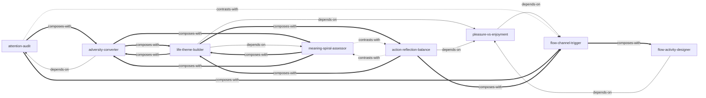

# 心流：最优体验心理学 — Skill Index

> 本书由 cangjie-skill 蒸馏, 共产出 **8** 个 skills。
> 处理时间: 2026-08-16

## 关于这本书

- **作者**: 米哈里·契克森米哈赖 (Mihaly Csikszentmihalyi)
- **出版年**: 1990 (英文原版) / 2017 (中信出版社中文版)
- **一句话主旨**: 幸福不取决于外在条件，而取决于控制意识、将注意力全神贯注于有挑战性的活动时自然涌现的最优体验
- **整书理解**: 见 [BOOK_OVERVIEW.md](./BOOK_OVERVIEW.md)
- **精华长文** (不读全书看这篇): [DIGEST.md](./DIGEST.md)
- **术语词典**: [GLOSSARY.md](./GLOSSARY.md)

---

## Skill 列表 (按主题分组)

### 心流诊断与触发

- [`flow-channel-trigger`](./flow-channel-trigger/SKILL.md) — 诊断活动的挑战-技巧比例，调整进入心流通道
- [`pleasure-vs-enjoyment`](./pleasure-vs-enjoyment/SKILL.md) — 区分恢复均衡型享乐与成长型乐趣，评估活动品质
- [`flow-activity-designer`](./flow-activity-designer/SKILL.md) — 为无聊/重复性活动注入心流要素（目标/规则/反馈/难度）

### 意识管理

- [`attention-audit`](./attention-audit/SKILL.md) — 诊断注意力带宽分配，识别精神熵来源并重分配

### 逆境与成长

- [`adversity-converter`](./adversity-converter/SKILL.md) — 将精神熵（打击/压力/创伤）转化为内在秩序（目标/挑战/成长）

### 人生意义

- [`life-theme-builder`](./life-theme-builder/SKILL.md) — 从分散目标中提炼统一人生主题，赋予整体生命意义
- [`meaning-spiral-assessor`](./meaning-spiral-assessor/SKILL.md) — 评估当前意义发展阶段，判断是否该前进
- [`action-reflection-balance`](./action-reflection-balance/SKILL.md) — 投入大目标前的五问自检与行动/反省平衡

---

## 引用图



图例:
- `-->` depends-on（A的使用需要先理解B）
- `-.->` contrasts-with（A和B是可选方案，看情境选一）
- `===>` composes-with（A和B经常配合使用）

---

## 推荐学习顺序

(从依赖图的叶子节点开始, 向上)

1. **pleasure-vs-enjoyment** — 最基础，理解享乐与乐趣的区别是后续所有 skill 的前提
2. **flow-channel-trigger** — 依赖 pleasure-vs-enjoyment，掌握心流的核心模型
3. **attention-audit** — 与 flow-channel-trigger 平行，从另一个角度理解意识管理
4. **flow-activity-designer** — 依赖前两者，将心流理论应用于改造无聊活动
5. **adversity-converter** — 依赖 attention-audit，将意识管理应用于逆境
6. **meaning-spiral-assessor** — 与 adversity-converter 平行，诊断人生发展阶段
7. **life-theme-builder** — 依赖前述多个 skill，构建整体意义系统
8. **action-reflection-balance** — 最终决策工具，在投入前做最后检查

---

## 安装使用

本目录是构建产物，宿主不会从这里加载 skill。要让 agent 真正调用，把 skill 目录复制到宿主的 skills 目录：

```bash
# TRAE (项目级)
cp -r flow-channel-trigger .trae/skills/
cp -r attention-audit .trae/skills/
# ... (全部8个)

# 或 Claude Code (项目级)
cp -r flow-channel-trigger <project>/.claude/skills/

# 或 Cursor (项目级)
cp -r flow-channel-trigger <project>/.cursor/skills/
```

---

## 审计轨迹

- 候选单元池: [candidates/](./candidates/)
- 三重验证结果: [verified.md](./verified.md)
- BOOK_OVERVIEW: [BOOK_OVERVIEW.md](./BOOK_OVERVIEW.md)
- 流水线状态: [PIPELINE_STATE.md](./PIPELINE_STATE.md)
