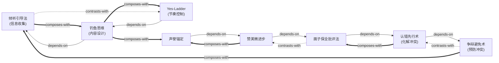

# how-to-win-friends-skills

由《人性的弱点》（*How to Win Friends and Influence People*）蒸馏出的一组**可被 AI Agent 调用的技能**（Skills）。

> 人是被「重要感」驱动的生物——你能让别人感到自己重要，就能赢得合作；你打击别人的自尊，就永远树敌。
> 卡耐基不靠逻辑演绎，而是用大量真实案例验证这套方法。本项目把这些方法论提炼成 8 个原子化技能，
> 让 Agent 能在真实场景里调用它们。

---

## 来源

| | |
|---|---|
| **书名** | 人性的弱点（*How to Win Friends and Influence People*） |
| **作者** | 戴尔·卡耐基（Dale Carnegie） |
| **出版** | 1936（英文原版） |
| **蒸馏工具** | cangjie-skill（仓颉：把长内容蒸馏成可调用技能的流水线） |
| **蒸馏方法** | RIA-TV++（整书理解 → 并行提取 → 三重验证 → RIA++ 构造 → 链接 → 压力测试 → 交付） |

---

## 8 个技能

### 说服策略

- [`bait-the-fish-thinking`](skills/bait-the-fish-thinking/SKILL.md) — **钓鱼思维**：从「我要什么」切换到「对方要什么」，用对方需求设计说服内容
- [`yes-ladder-socratic`](skills/yes-ladder-socratic/SKILL.md) — **Yes-Ladder 苏格拉底法**：用连续「是」建立合作基调，再逐步引入分歧点
- [`listening-as-persuasion`](skills/listening-as-persuasion/SKILL.md) — **倾听引导法**：说服不是说更多，而是让对方说更多；沉默本身是说服工具

### 冲突管理

- [`argument-avoidance`](skills/argument-avoidance/SKILL.md) — **争辩避免术**：争辩中没有赢家；用非对抗方式达成同样目的
- [`preemptive-self-criticism`](skills/preemptive-self-criticism/SKILL.md) — **认错先行术**：在对方指责你之前主动认错，解除对方的攻击能量

### 行为改变

- [`face-saving-feedback`](skills/face-saving-feedback/SKILL.md) — **面子保全批评法**：五组件批评公式（赞美铺垫→间接指出→自我暴露→提问代替命令→保全面子）
- [`micro-progress-praise`](skills/micro-progress-praise/SKILL.md) — **赞美微进步**：不等完美才表扬，在任何微小进步出现的当下立即赞美
- [`reputation-anchoring`](skills/reputation-anchoring/SKILL.md) — **声誉锚定**：通过公开赋予正面身份标签，激发对方自觉向标签靠拢

---

## 技能之间的引用关系



图例：`-->` 依赖 · `-.->` 二选一 · `===>` 常配合使用

**推荐学习顺序**（从叶子节点向上）：`listening-as-persuasion` → `bait-the-fish-thinking` → `argument-avoidance` → `yes-ladder-socratic` → `preemptive-self-criticism` → `face-saving-feedback` → `micro-progress-praise` → `reputation-anchoring`

---

## 安装

每个技能目录都包含 `SKILL.md`（+ `test-prompts.json` / `test-results.md` 测试产物），可直接复制到宿主环境：

```bash
# Claude Code（用户级，所有项目可用）
cp -r skills/* ~/.claude/skills/

# 或 Claude Code（项目级）
cp -r skills/* <project>/.claude/skills/

# Trae（项目级）
cp -r skills/* <project>/.trae/skills/

# Cursor（项目级）
cp -r skills/* <project>/.cursor/skills/
```

---

## 完整文档

`docs/` 目录保留了完整的蒸馏产物与审计轨迹：

| 文件 | 说明 |
|---|---|
| [`DIGEST.md`](docs/DIGEST.md) | 面向读者的精华长文（不读全书看这篇，约 6500 字） |
| [`GLOSSARY.md`](docs/GLOSSARY.md) | 8 个共享术语词典（重要感/钓鱼思维/争辩/面子/声誉锚定…） |
| [`INDEX.md`](docs/INDEX.md) | 技能总览 + 引用图 + 学习顺序 |
| [`BOOK_OVERVIEW.md`](docs/BOOK_OVERVIEW.md) | 整书理解（结构/解释/批判/应用潜力） |
| [`verified.md`](docs/verified.md) | 三重验证结果（64 候选 → 8 通过） |
| [`PIPELINE_STATE.md`](docs/PIPELINE_STATE.md) | 流水线各阶段状态 |
| [`TEST_RESULTS.md`](docs/TEST_RESULTS.md) | 压力测试汇总（总通过率 96.9%） |
| [`candidates/`](docs/candidates/) | 5 个提取器的原始候选池 |

---

## 目录结构

```text
how-to-win-friends-skills/
├── README.md
├── skills/                      # 8 个可安装技能（核心交付物）
│   └── <skill-slug>/
│       ├── SKILL.md             # 技能定义（R/I/A1/A2/E/B 六段）
│       ├── test-prompts.json    # 触发/诱饵测试集
│       └── test-results.md      # 压力测试结果
└── docs/                        # 蒸馏文档与审计轨迹
    ├── DIGEST.md / GLOSSARY.md / INDEX.md
    ├── BOOK_OVERVIEW.md / verified.md / PIPELINE_STATE.md
    ├── TEST_RESULTS.md
    └── candidates/              # 框架/原则/案例/反例/术语 候选池
```

---

## 关于内容与版权

本项目是**方法论蒸馏产物**，不含原书全文：

- 每个技能对原书的引用严格控制在**短引用 + 转述**范畴，属于合理引用；
- 原文的版权归原作者戴尔·卡耐基及其中文译本的译者/出版社所有；
- 建议购买正版书籍配合使用。

---

## 如何重新生成

本项目由 cangjie-skill（仓颉蒸馏流水线）自动生成。若要复现或调整：

1. 准备书籍文本（`fulltext.txt`，从 EPUB 提取）
2. 运行 RIA-TV++ 流水线（阶段 0–5，详见 `docs/PIPELINE_STATE.md`）
3. 通过三重验证 + 压力测试的单元会被构造为独立技能并安装

如需让技能持续进化，可喂给 `darwin-skill`：`darwin evolve how-to-win-friends-skills/`
