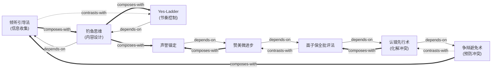

# 人性的弱点 — Skill Index

> 本书由 cangjie-skill 蒸馏, 共产出 **8** 个 skills。
> 处理时间: 2026-08-16

## 关于这本书

- **作者**: 戴尔·卡耐基 (Dale Carnegie)
- **出版年**: 1936
- **一句话主旨**: 人是被"重要感"驱动的生物——你能让别人感到自己重要，就能赢得合作；你打击别人的自尊，就永远树敌。
- **整书理解**: 见 [BOOK_OVERVIEW.md](./BOOK_OVERVIEW.md)
- **精华长文** (不读全书看这篇): [DIGEST.md](./DIGEST.md)
- **术语词典**: [GLOSSARY.md](./GLOSSARY.md)

---

## Skill 列表 (按主题分组)

### 说服策略 (Persuasion Strategy)

- [`bait-the-fish-thinking`](../skills/bait-the-fish-thinking/SKILL.md) — 从"我要什么"切换到"对方想要什么"，用对方需求设计说服内容
- [`yes-ladder-socratic`](../skills/yes-ladder-socratic/SKILL.md) — 用连续"是"建立合作基调，再逐步引入分歧点
- [`listening-as-persuasion`](../skills/listening-as-persuasion/SKILL.md) — 说服不是说更多，而是让对方说更多；沉默本身是说服工具

### 冲突管理 (Conflict Management)

- [`argument-avoidance`](../skills/argument-avoidance/SKILL.md) — 争辩中没有赢家；用非对抗方式达成同样目的
- [`preemptive-self-criticism`](../skills/preemptive-self-criticism/SKILL.md) — 在对方指责你之前主动认错，解除对方的攻击能量

### 行为改变 (Behavior Change)

- [`face-saving-feedback`](../skills/face-saving-feedback/SKILL.md) — 五组件批评公式：赞美铺垫→间接指出→自我暴露→提问代替命令→保全面子
- [`micro-progress-praise`](../skills/micro-progress-praise/SKILL.md) — 不等完美才表扬，在任何微小进步出现的当下立即赞美
- [`reputation-anchoring`](../skills/reputation-anchoring/SKILL.md) — 通过公开赋予正面身份标签，激发对方自觉向标签靠拢

---

## 引用图



图例:
- `-->`  depends-on (A 的使用前提是先理解 B)
- `-.->` contrasts-with (A 和 B 是两种可选方案，看情境选一)
- `===>` composes-with (A 和 B 经常配合使用)

---

## 推荐学习顺序

(从依赖图的叶子节点开始，向上)

1. **`listening-as-persuasion`** — 最基础，所有说服的起点。先学会"让对方说"，才能收集到设计"饵"所需的信息。
2. **`bait-the-fish-thinking`** — 依赖倾听。有了对方需求信息后，设计满足对方需求的说服内容。
3. **`argument-avoidance`** — 预防性基本功。在说服之前，先学会"不要走进争辩的陷阱"。
4. **`yes-ladder-socratic`** — 依赖钓鱼思维。确定了"说什么"后，用 yes-ladder 设计"怎么说"。
5. **`preemptive-self-criticism`** — 依赖争辩避免（理解了争辩的危害后，学会冲突发生时如何化解）。
6. **`face-saving-feedback`** — 依赖认错先行。先学会了"如何认自己的错"，再学"如何指出对方的错但不伤面子"。
7. **`micro-progress-praise`** — 依赖面子保全批评法（理解了"不伤面子"的原理后，学会用正向强化推动改变）。
8. **`reputation-anchoring`** — 最高级的间接影响技术。依赖前述所有技能的基础。

---

## 安装使用

本目录是构建产物，宿主不会从这里加载 skill。要让 agent 真正调用，把 skill 目录复制到宿主的 skills 目录：

```bash
# 用户级 (所有项目可用)
cp -r <skill-slug> ~/.claude/skills/

# 或项目级
cp -r <skill-slug> <project>/.claude/skills/    # Claude Code
cp -r <skill-slug> <project>/.cursor/skills/    # Cursor
```

本蒸馏已安装到 `.trae/skills/` 目录。

---

## 接入 darwin-skill

所有 skill 均带有 `test-prompts.json` (darwin-skill 兼容格式)，可直接接入自动进化：

```
darwin evolve how-to-win-friends-skills/
```

---

## 审计轨迹

- 候选单元池: [candidates/](./candidates/)
- 被淘汰的候选 (含原因): 见 [verified.md](./verified.md) 末尾表格
- BOOK_OVERVIEW: [BOOK_OVERVIEW.md](./BOOK_OVERVIEW.md)
- 三重验证结果: [verified.md](./verified.md)
