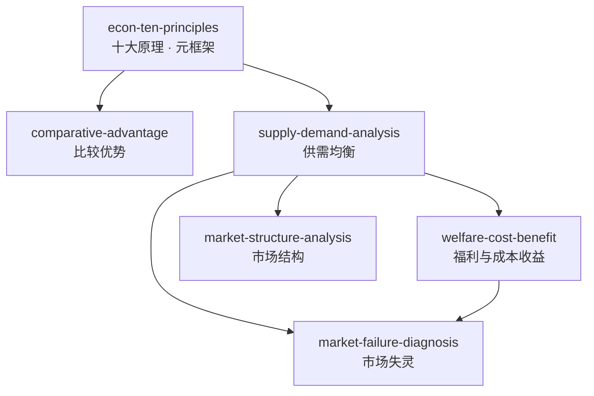

# 曼昆微观经济学

由曼昆《经济学原理（第 8 版）：微观经济学分册》蒸馏出的一组**可被 AI Agent 调用的技能**（Skills）。

> 把经济学的基础思维工具——权衡取舍、机会成本、边际分析、供需均衡、市场效率与失灵——
> 提炼成 6 个原子化技能，让 Agent 能在真实的经济决策、政策评估与产业分析场景里调用它们。

---

## 来源

| | |
|---|---|
| **书名** | 经济学原理（第 8 版）：微观经济学分册（*Principles of Economics, 8th Ed. — Microeconomics*） |
| **作者** | N. Gregory Mankiw（N. 格里高利·曼昆）· 译：梁小民、梁砾 |
| **出版** | 2020 · 北京大学出版社 |
| **蒸馏工具** | cangjie-skill（仓颉：把长内容蒸馏成可调用技能的流水线） |
| **蒸馏方法** | RIA-TV++（整书理解 → 并行提取 → 三重验证 → RIA++ 构造 → 链接 → 压力测试 → 交付） |

---

## 6 个技能

- [`econ-ten-principles`](skills/econ-ten-principles/SKILL.md) — **经济学十大原理决策框架**：用 10 条原理快速搭建经济学思维脚手架（Ch1，元框架入口）
- [`comparative-advantage`](skills/comparative-advantage/SKILL.md) — **比较优势与贸易决策**：通过机会成本比较确定最优分工与贸易（Ch3）
- [`supply-demand-analysis`](skills/supply-demand-analysis/SKILL.md) — **供需均衡分析框架**：四步法分析市场冲击对价格和数量的影响（Ch4–6，核心工具）
- [`welfare-cost-benefit`](skills/welfare-cost-benefit/SKILL.md) — **福利经济学与成本收益分析**：用剩余分析评价政策/项目的效率与分配（Ch7–8）
- [`market-failure-diagnosis`](skills/market-failure-diagnosis/SKILL.md) — **市场失灵诊断框架**：系统识别市场失灵类型并匹配政策工具（Ch10–11）
- [`market-structure-analysis`](skills/market-structure-analysis/SKILL.md) — **市场结构分析框架**：从竞争到垄断的连续谱分析，预测企业行为（Ch13–17）

---

## 技能之间的引用关系



图例：`-->` 依赖（`econ-ten-principles` 是入口元框架，其余 skill 都从它或 `supply-demand-analysis` 延伸）

**推荐学习顺序**：`econ-ten-principles` → `comparative-advantage` → `supply-demand-analysis` → `welfare-cost-benefit` → `market-failure-diagnosis` → `market-structure-analysis`（大致沿章节顺序，从原理到工具、从定性到定量）

**快速决策指南**：

| 你的问题 | 调用哪个 Skill |
|---|---|
| 经济学入门 / 快速诊断 | `econ-ten-principles` |
| 分工 / 贸易 / 外包决策 | `comparative-advantage` |
| 市场价格 / 数量变化分析 | `supply-demand-analysis` |
| 政策效率 / 成本收益评估 | `welfare-cost-benefit` |
| 市场为什么失灵 / 怎么干预 | `market-failure-diagnosis` |
| 行业竞争 / 企业定价策略 | `market-structure-analysis` |

---

## 安装

每个技能目录都包含 `SKILL.md`（+ `test-prompts.json` / `test-results.md` 测试产物），可直接复制到宿主环境：

```bash
# Claude Code（用户级，所有项目可用）
cp -r skills/* ~/.claude/skills/

# 或 Claude Code（项目级）
cp -r skills/* <project>/.claude/skills/

# Trae（项目级）
cp -r skills/* <project>/.trae/skills/

# Cursor（项目级）
cp -r skills/* <project>/.cursor/skills/
```

---

## 完整文档

`docs/` 目录保留了完整的蒸馏产物与审计轨迹：

| 文件 | 说明 |
|---|---|
| [`DIGEST.md`](docs/DIGEST.md) | 面向读者的精华长文（不读全书看这篇） |
| [`GLOSSARY.md`](docs/GLOSSARY.md) | 共享术语词典（80+ 核心术语） |
| [`INDEX.md`](docs/INDEX.md) | 技能总览 + 引用图 + 决策树 |
| [`BOOK_OVERVIEW.md`](docs/BOOK_OVERVIEW.md) | 整书理解（结构/解释/批判/应用潜力） |
| [`verified.md`](docs/verified.md) | 三重验证结果（候选池 → 6 通过） |
| [`PIPELINE_STATE.md`](docs/PIPELINE_STATE.md) | 流水线各阶段状态 |
| [`candidates/`](docs/candidates/) | 5 个提取器的原始候选池（框架/原则/案例/反例/术语） |

---

## 目录结构

```text
mankiw-microeconomics/
├── README.md
├── skills/                      # 6 个可安装技能（核心交付物）
│   └── <skill-slug>/
│       ├── SKILL.md             # 技能定义（R/I/A1/A2/E/B 六段）
│       ├── test-prompts.json    # 触发/诱饵测试集
│       └── test-results.md      # 压力测试结果
└── docs/                        # 蒸馏文档与审计轨迹
    ├── DIGEST.md / GLOSSARY.md / INDEX.md
    ├── BOOK_OVERVIEW.md / verified.md / PIPELINE_STATE.md
    └── candidates/              # 框架/原则/案例/反例/术语 候选池
```

---

## 关于内容与版权

本项目是**方法论蒸馏产物**，不含原书全文：

- 每个技能对原书的引用严格控制在**≤150 字/段**，属于合理引用范畴；
- 原文的版权归原作者曼昆、译者及北京大学出版社所有；
- 建议购买正版书籍配合使用。

---

## 如何重新生成

本项目由 cangjie-skill（仓颉蒸馏流水线）自动生成。若要复现或调整：

1. 准备书籍文本（从扫描版 PDF 经 OCR 提取为 `fulltext.txt`）
2. 运行 RIA-TV++ 流水线（阶段 0–5，详见 `docs/PIPELINE_STATE.md`）
3. 通过三重验证 + 压力测试的单元会被构造为独立技能并安装

如需让技能持续进化，可喂给 `darwin-skill`：`darwin evolve mankiw-microeconomics/`
