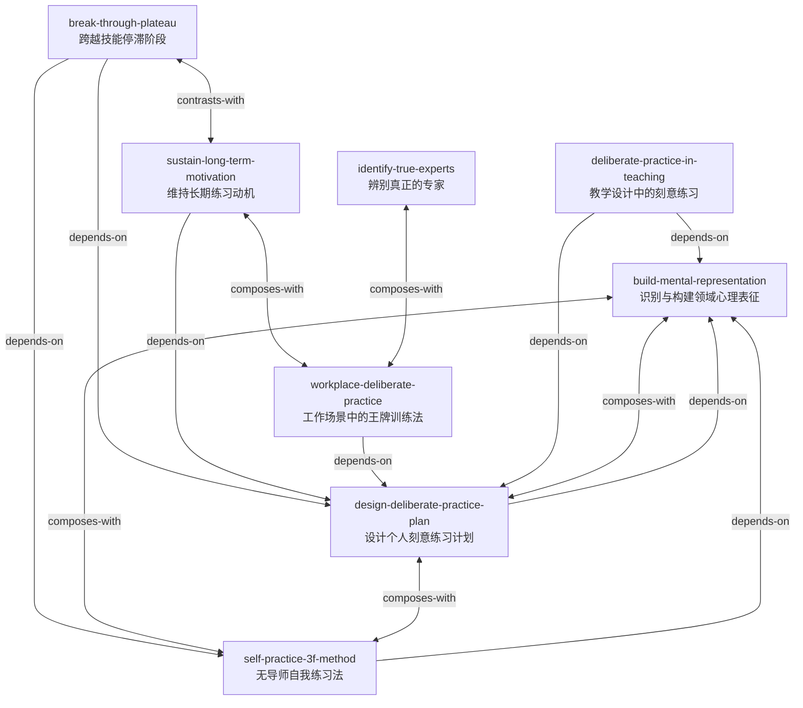

# 刻意练习：如何从新手到大师

由《刻意练习》（*PEAK: Secrets from the New Science of Expertise*）蒸馏出的一组**可被 AI Agent 调用的技能**（Skills）。

> 杰出表现并非依赖天生才华，而是通过一套以走出舒适区、获得即时反馈、持续构建高质量心理表征为核心的训练方法——
> 刻意练习——被系统地塑造出来。本项目把这些方法论提炼成 8 个原子化技能，让 Agent 能在真实场景里调用它们。

---

## 来源

| | |
|---|---|
| **书名** | 刻意练习：如何从新手到大师（*PEAK: Secrets from the New Science of Expertise*） |
| **作者** | 安德斯·艾利克森（Anders Ericsson）、罗伯特·普尔（Robert Pool） |
| **出版** | 2016 |
| **蒸馏工具** | cangjie-skill（仓颉：把长内容蒸馏成可调用技能的流水线） |
| **蒸馏方法** | RIA-TV++（整书理解 → 并行提取 → 三重验证 → RIA++ 构造 → 链接 → 压力测试 → 交付） |

---

## 8 个技能

### 核心概念

- [`build-mental-representation`](skills/build-mental-representation/SKILL.md) — **识别与构建领域心理表征**：让零散信息变成可指导行动的模式，是所有训练要创建的核心结构

### 个人刻意练习

- [`design-deliberate-practice-plan`](skills/design-deliberate-practice-plan/SKILL.md) — **设计个人刻意练习计划**：把长期技能目标拆解为可逐级加码、带即时反馈的训练蓝图
- [`self-practice-3f-method`](skills/self-practice-3f-method/SKILL.md) — **无导师自我练习法（3F）**：用 Focus / Feedback / Fix it 三阶段自我训练
- [`break-through-plateau`](skills/break-through-plateau/SKILL.md) — **跨越技能停滞阶段**：诊断真实瓶颈，用针对性练习或变换刺激突破平台期
- [`sustain-long-term-motivation`](skills/sustain-long-term-motivation/SKILL.md) — **维持长期练习动机**：把坚持从「意志力」重新设计为减少停止理由、放大继续理由的系统

### 组织与教育应用

- [`identify-true-experts`](skills/identify-true-experts/SKILL.md) — **辨别真正的专家**：用客观指标、同行评价与小型真实任务避免经验陷阱
- [`workplace-deliberate-practice`](skills/workplace-deliberate-practice/SKILL.md) — **工作场景中的王牌训练法**：把工作改造成「低风险仿真 + 即时反馈 + 快速迭代」
- [`deliberate-practice-in-teaching`](skills/deliberate-practice-in-teaching/SKILL.md) — **教学设计中的刻意练习**：以「学生能做什么」为目标，把课程设计成舒适区边缘任务与即时反馈循环

---

## 技能之间的引用关系



图例：`depends-on` 依赖 · `composes-with` 常配合使用 · `contrasts-with` 二选一

**推荐学习顺序**：`build-mental-representation` → `design-deliberate-practice-plan` → `self-practice-3f-method` → `sustain-long-term-motivation` → `break-through-plateau` → `identify-true-experts` → `workplace-deliberate-practice` → `deliberate-practice-in-teaching`

---

## 安装

每个技能目录都包含 `SKILL.md`（+ `test-prompts.json` / `test-results.md` 测试产物），可直接复制到宿主环境：

```bash
# Claude Code（用户级，所有项目可用）
cp -r skills/* ~/.claude/skills/

# 或 Claude Code（项目级）
cp -r skills/* <project>/.claude/skills/

# Trae（项目级）
cp -r skills/* <project>/.trae/skills/

# Cursor（项目级）
cp -r skills/* <project>/.cursor/skills/
```

---

## 完整文档

`docs/` 目录保留了完整的蒸馏产物与审计轨迹：

| 文件 | 说明 |
|---|---|
| [`DIGEST.md`](docs/DIGEST.md) | 面向读者的精华长文（不读全书看这篇，约 6700 字） |
| [`GLOSSARY.md`](docs/GLOSSARY.md) | 共享术语词典（心理表征/刻意练习/舒适区/反馈…） |
| [`INDEX.md`](docs/INDEX.md) | 技能总览 + 引用图 + 学习顺序 |
| [`BOOK_OVERVIEW.md`](docs/BOOK_OVERVIEW.md) | 整书理解（结构/解释/批判/应用潜力） |
| [`verified.md`](docs/verified.md) | 三重验证结果（候选池 → 8 通过） |
| [`PIPELINE_STATE.md`](docs/PIPELINE_STATE.md) | 流水线各阶段状态 |
| [`candidates/`](docs/candidates/) | 5 个提取器的原始候选池 |
| [`rejected/`](docs/rejected/) | 被淘汰的候选（含原因） |

---

## 目录结构

```text
peak-deliberate-practice/
├── README.md
├── skills/                      # 8 个可安装技能（核心交付物）
│   └── <skill-slug>/
│       ├── SKILL.md             # 技能定义（R/I/A1/A2/E/B 六段）
│       ├── test-prompts.json    # 触发/诱饵测试集
│       └── test-results.md      # 压力测试结果
└── docs/                        # 蒸馏文档与审计轨迹
    ├── DIGEST.md / GLOSSARY.md / INDEX.md
    ├── BOOK_OVERVIEW.md / verified.md / PIPELINE_STATE.md
    ├── candidates/              # 框架/原则/案例/反例/术语 候选池
    └── rejected/                # 淘汰候选
```

---

## 关于内容与版权

本项目是**方法论蒸馏产物**，不含原书全文：

- 每个技能对原书的引用严格控制在**≤150 字/段**，属于合理引用范畴；
- 原文的版权归原作者安德斯·艾利克森、罗伯特·普尔及出版社所有；
- 建议购买正版书籍配合使用。

---

## 如何重新生成

本项目由 cangjie-skill（仓颉蒸馏流水线）自动生成。若要复现或调整：

1. 准备书籍文本（`fulltext.txt`，从 EPUB 提取）
2. 运行 RIA-TV++ 流水线（阶段 0–5，详见 `docs/PIPELINE_STATE.md`）
3. 通过三重验证 + 压力测试的单元会被构造为独立技能并安装

如需让技能持续进化，可喂给 `darwin-skill`：`darwin evolve peak-deliberate-practice/`
