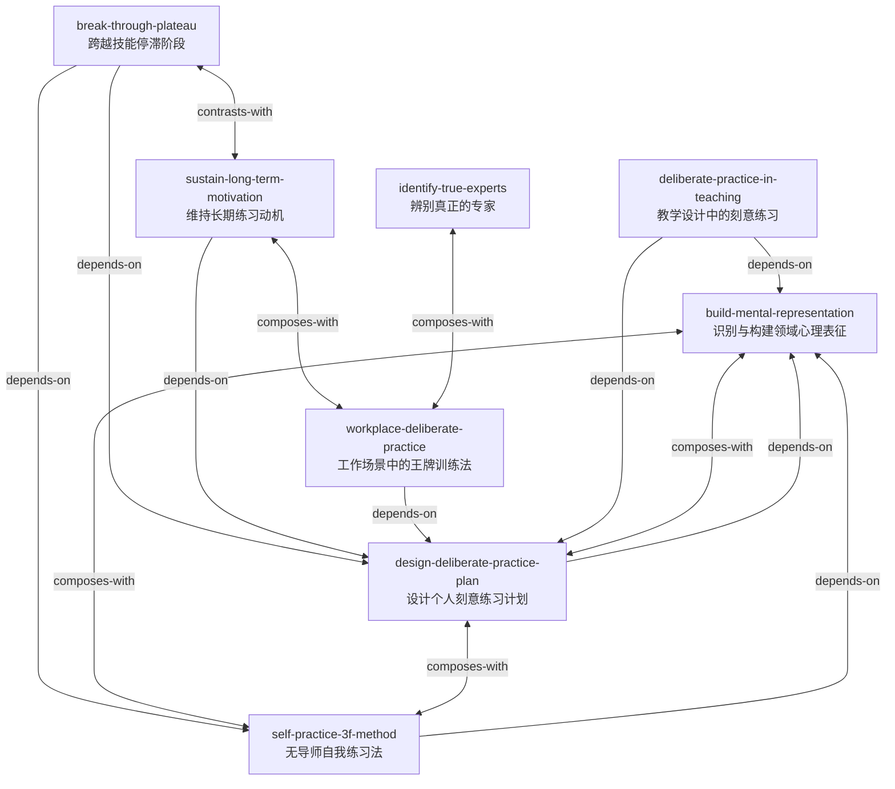

# 刻意练习：如何从新手到大师 — Skill Index

> 本书由 cangjie-skill 蒸馏, 共产出 **8** 个 skills。
> 处理时间: 2026-08-20

## 关于这本书

- **作者**: 安德斯·艾利克森（Anders Ericsson）、罗伯特·普尔（Robert Pool）
- **出版年**: 2016
- **一句话主旨**: 杰出表现并非依赖天生才华，而是通过一套以走出舒适区、获得即时反馈、持续构建高质量心理表征为核心的训练方法——刻意练习——被系统地塑造出来。
- **整书理解**: 见 [BOOK_OVERVIEW.md](./BOOK_OVERVIEW.md)
- **术语词典**: [GLOSSARY.md](./GLOSSARY.md)

---

## Skill 列表 (按主题分组)

### 核心概念

- [`build-mental-representation`](../skills/build-mental-representation/SKILL.md) — 识别并构建领域特定的心理表征，让零散信息变成可指导行动的模式。

### 个人刻意练习

- [`design-deliberate-practice-plan`](../skills/design-deliberate-practice-plan/SKILL.md) — 把长期技能目标拆解为可逐级加码、带即时反馈的训练计划。
- [`self-practice-3f-method`](../skills/self-practice-3f-method/SKILL.md) — 无导师场景下用 Focus / Feedback / Fix it 三阶段自我训练。
- [`break-through-plateau`](../skills/break-through-plateau/SKILL.md) — 诊断技能停滞的真实瓶颈，用针对性练习或变换刺激突破平台期。
- [`sustain-long-term-motivation`](../skills/sustain-long-term-motivation/SKILL.md) — 把长期坚持从“意志力”重新设计为减少停止理由、放大继续理由的系统。

### 组织与教育应用

- [`identify-true-experts`](../skills/identify-true-experts/SKILL.md) — 用客观指标、同行评价与小型真实任务辨别真正的专家，避免经验陷阱。
- [`workplace-deliberate-practice`](../skills/workplace-deliberate-practice/SKILL.md) — 把工作场景改造成“低风险仿真 + 即时反馈 + 快速迭代”的王牌训练。
- [`deliberate-practice-in-teaching`](../skills/deliberate-practice-in-teaching/SKILL.md) — 以“学生能做什么”为目标，把课程设计成舒适区边缘任务与即时反馈循环。

---

## 引用图



图例:
- `-->`  depends-on
- `<-->`  composes-with（双向）
- `<--->` contrasts-with（双向）

---

## 推荐学习顺序

(从依赖图的叶子节点开始, 向上)

1. **识别与构建领域心理表征** — 最基础的概念，没有前置；理解它是所有后续训练要创建和依赖的核心结构。
2. **设计个人刻意练习计划** — 依赖心理表征概念；把“想提高”转化为可执行的逐级训练蓝图。
3. **无导师自我练习法（3F 法）** — 依赖心理表征，与计划互补；在找不到导师时执行单次 focus-feedback-fix 循环。
4. **维持长期练习动机** — 依赖训练计划；解决“怎么不放弃”，让计划持续运行。
5. **跨越技能停滞阶段** — 依赖计划和 3F 法；当指标长期持平时诊断瓶颈、调整方法。
6. **辨别真正的专家 / 避免经验陷阱** — 相对独立；为学习计划或工作训练挑选真正高水平的导师/榜样/反馈者。
7. **工作场景中的王牌训练法 / 边干边学** — 依赖计划；把个人刻意练习原则迁移到组织和职场。
8. **教学设计中的刻意练习** — 依赖心理表征和计划；把同一套原则用于课程与学生培养。

---

## 安装使用

本目录是构建产物, 宿主不会从这里加载 skill。要让 agent 真正调用, 把 skill 目录复制到宿主的 skills 目录:

```bash
# 用户级 (所有项目可用)
cp -r design-deliberate-practice-plan ~/.claude/skills/

# 或项目级
cp -r design-deliberate-practice-plan <project>/.claude/skills/    # Claude Code
cp -r design-deliberate-practice-plan <project>/.cursor/skills/    # Cursor
```

---

## 接入 darwin-skill

所有 skill 均带有 `test-prompts.json` (darwin-skill 兼容格式), 可直接接入自动进化:

```
darwin evolve books/peak-deliberate-practice/
```

---

## 审计轨迹

- 候选单元池: [candidates/](./candidates/)
- 被淘汰的候选 (含原因): [rejected/](./rejected/)
- BOOK_OVERVIEW: [BOOK_OVERVIEW.md](./BOOK_OVERVIEW.md)
