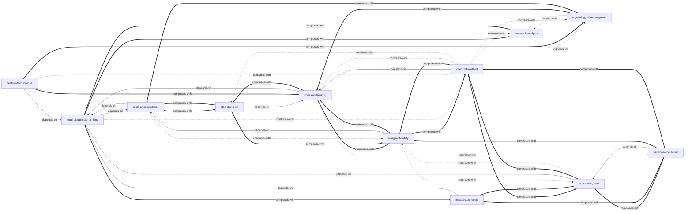

# 穷查理宝典

由《穷查理宝典：查理·芒格智慧箴言录》蒸馏出的一组**可被 AI Agent 调用的技能**（Skills）。

> 通过跨学科的重要思维模型、诚实面对自身局限、在能力圈内保持纪律与耐心，
> 从而少犯愚蠢的错误并抓住少数关键机会。本项目把芒格的「思维工具箱」提炼成 12 个原子化技能，
> 让 Agent 能在真实决策场景里调用它们。

---

## 来源

| | |
|---|---|
| **书名** | 穷查理宝典：查理·芒格智慧箴言录（全新增订本） |
| **作者** | 查理·芒格（Charles T. Munger）/ 编：彼得·考夫曼 |
| **出版** | 2021（全新增订本，原书首版 2005） |
| **蒸馏工具** | cangjie-skill（仓颉：把长内容蒸馏成可调用技能的流水线） |
| **蒸馏方法** | RIA-TV++（整书理解 → 并行提取 → 三重验证 → RIA++ 构造 → 链接 → 压力测试 → 交付） |

---

## 12 个技能

### 认知框架：如何正确地想

- [`multi-disciplinary-thinking`](skills/multi-disciplinary-thinking/SKILL.md) — **多元思维模型**：面对复杂问题时调用多学科重要模型避免片面结论（「铁锤人」的解药）
- [`two-track-analysis`](skills/two-track-analysis/SKILL.md) — **双轨分析**：同时分析理性事实和心理误判两条轨道

### 决策过滤器：判断值不值得做

- [`circle-of-competence`](skills/circle-of-competence/SKILL.md) — **能力圈**：判断一件事是否在「我真正懂」的边界内
- [`opportunity-cost`](skills/opportunity-cost/SKILL.md) — **机会成本**：用「第二好选择」的真实代价来衡量决策
- [`margin-of-safety`](skills/margin-of-safety/SKILL.md) — **安全边际**：为错误、坏运气和不确定性预留缓冲

### 逆向与减法：先避开失败

- [`inversion-thinking`](skills/inversion-thinking/SKILL.md) — **逆向思维**：先问「怎么失败 / 怎么死」，再排除失败路径
- [`stop-doing-list`](skills/stop-doing-list/SKILL.md) — **Stop Doing List**：明确列出自己不会做的事、不会碰的领域
- [`destroy-favorite-idea`](skills/destroy-favorite-idea/SKILL.md) — **破坏最爱的观念**：主动证伪自己最坚信的想法

### 执行防错：防止聪明人犯低级错误

- [`checklist-method`](skills/checklist-method/SKILL.md) — **检查清单法**：重大决策前强制过一遍关键风险点
- [`psychology-of-misjudgment`](skills/psychology-of-misjudgment/SKILL.md) — **人类误判心理学**：用 25 种心理倾向清单复盘判断失误

### 行动节奏：什么时候动、怎么动

- [`patience-and-action`](skills/patience-and-action/SKILL.md) — **耐心与果断**：克制行动偏好，等待高确定性机会再出击

### 非线性结果：识别多因素共振

- [`lollapalooza-effect`](skills/lollapalooza-effect/SKILL.md) — **Lollapalooza 效应**：识别多因素共振导致的非线性结果

---

## 技能之间的引用关系



图例：`-->` 依赖 · `-.->` 互补或对照 · `===>` 常组合使用

**推荐学习顺序**：`circle-of-competence` → `multi-disciplinary-thinking` → `two-track-analysis` → `psychology-of-misjudgment` → `inversion-thinking` → `stop-doing-list` → `checklist-method` → `opportunity-cost` → `margin-of-safety` → `patience-and-action` → `lollapalooza-effect` → `destroy-favorite-idea`

---

## 安装

每个技能目录都包含 `SKILL.md`（+ `test-prompts.json` / `test-results.md` 测试产物），可直接复制到宿主环境：

```bash
# Claude Code（用户级，所有项目可用）
cp -r skills/* ~/.claude/skills/

# 或 Claude Code（项目级）
cp -r skills/* <project>/.claude/skills/

# Trae（项目级）
cp -r skills/* <project>/.trae/skills/

# Cursor（项目级）
cp -r skills/* <project>/.cursor/skills/
```

---

## 完整文档

`docs/` 目录保留了完整的蒸馏产物与审计轨迹：

| 文件 | 说明 |
|---|---|
| [`DIGEST.md`](docs/DIGEST.md) | 面向读者的精华长文（不读全书看这篇） |
| [`GLOSSARY.md`](docs/GLOSSARY.md) | 共享术语词典（能力圈/逆向思维/机会成本/安全边际…） |
| [`INDEX.md`](docs/INDEX.md) | 技能总览 + 引用图 + 学习顺序 |
| [`BOOK_OVERVIEW.md`](docs/BOOK_OVERVIEW.md) | 整书理解（结构/解释/批判/应用潜力） |
| [`verified.md`](docs/verified.md) | 三重验证结果（含淘汰候选及原因） |
| [`PIPELINE_STATE.md`](docs/PIPELINE_STATE.md) | 流水线各阶段状态 |
| [`TEST_REPORT.md`](docs/TEST_REPORT.md) | 压力测试静态审查报告 |
| [`candidates/`](docs/candidates/) | 5 个提取器的原始候选池 |

---

## 目录结构

```text
poor-charlies-almanack/
├── README.md
├── skills/                      # 12 个可安装技能（核心交付物）
│   └── <skill-slug>/
│       ├── SKILL.md             # 技能定义（R/I/A1/A2/E/B 六段）
│       ├── test-prompts.json    # 触发/诱饵测试集
│       └── test-results.md      # 压力测试结果
└── docs/                        # 蒸馏文档与审计轨迹
    ├── DIGEST.md / GLOSSARY.md / INDEX.md
    ├── BOOK_OVERVIEW.md / verified.md / PIPELINE_STATE.md / TEST_REPORT.md
    └── candidates/              # 框架/原则/案例/反例/术语 候选池
```

---

## 关于内容与版权

本项目是**方法论蒸馏产物**，不含原书全文：

- 每个技能对原书的引用严格控制在**≤150 字/段**，属于合理引用范畴；
- 原文的版权归原作者查理·芒格、编者彼得·考夫曼及出版社所有；
- 建议购买正版书籍配合使用。

---

## 如何重新生成

本项目由 cangjie-skill（仓颉蒸馏流水线）自动生成。若要复现或调整：

1. 准备书籍文本（`fulltext.txt`，从 EPUB 提取）
2. 运行 RIA-TV++ 流水线（阶段 0–5，详见 `docs/PIPELINE_STATE.md`）
3. 通过三重验证 + 压力测试的单元会被构造为独立技能并安装

如需让技能持续进化，可喂给 `darwin-skill`：`darwin evolve poor-charlies-almanack/`
