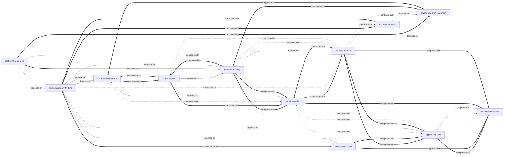

# 《穷查理宝典》— Skill Index

> 本书由 cangjie-skill 蒸馏，共产出 **12** 个 skills。
> 处理时间：2026-08-23

---

## 关于这本书

- **书名**：《穷查理宝典：查理·芒格智慧箴言录（全新增订本）》
- **作者**：查理·芒格（Charles T. Munger）/ 编：彼得·考夫曼
- **出版年**：2021 年 7 月（全新增订本，原书首版 2005 年）
- **一句话主旨**：通过跨学科的重要思维模型、诚实面对自身局限、在能力圈内保持纪律与耐心，从而少犯愚蠢的错误并抓住少数关键机会。
- **整书理解**：见 [BOOK_OVERVIEW.md](./BOOK_OVERVIEW.md)
- **精华长文**：见 [DIGEST.md](./DIGEST.md)
- **术语词典**：见 [GLOSSARY.md](./GLOSSARY.md)
- **使用指南**：见 [README.md](./README.md)

---

## Skill 列表（按主题分组）

### 1. 认知框架：如何正确地想

- [`multi-disciplinary-thinking`](../skills/multi-disciplinary-thinking/SKILL.md) — 面对复杂问题时，调用多学科重要模型避免片面结论（“铁锤人”的解药）
- [`two-track-analysis`](../skills/two-track-analysis/SKILL.md) — 同时分析理性事实和心理误判两条轨道

### 2. 决策过滤器：判断值不值得做

- [`circle-of-competence`](../skills/circle-of-competence/SKILL.md) — 判断一件事是否在“我真正懂”的边界内
- [`opportunity-cost`](../skills/opportunity-cost/SKILL.md) — 用“第二好选择”的真实代价来衡量决策
- [`margin-of-safety`](../skills/margin-of-safety/SKILL.md) — 为错误、坏运气和不确定性预留缓冲

### 3. 逆向与减法：先避开失败

- [`inversion-thinking`](../skills/inversion-thinking/SKILL.md) — 先问“怎么失败/怎么死”，再排除失败路径
- [`stop-doing-list`](../skills/stop-doing-list/SKILL.md) — 明确列出自己不会做的事、不会碰的领域
- [`destroy-favorite-idea`](../skills/destroy-favorite-idea/SKILL.md) — 主动证伪自己最坚信的想法

### 4. 执行防错：防止聪明人犯低级错误

- [`checklist-method`](../skills/checklist-method/SKILL.md) — 重大决策前强制过一遍关键风险点
- [`psychology-of-misjudgment`](../skills/psychology-of-misjudgment/SKILL.md) — 用 25 种心理倾向清单复盘判断失误

### 5. 行动节奏：什么时候动、怎么动

- [`patience-and-action`](../skills/patience-and-action/SKILL.md) — 克制行动偏好，等待高确定性机会再出击

### 6. 非线性结果：识别多因素共振

- [`lollapalooza-effect`](../skills/lollapalooza-effect/SKILL.md) — 识别多因素共振导致的非线性结果

---

## 引用图



图例：

- `-->` depends-on：依赖前置 skill
- `-.->` contrasts-with：互补或对照关系
- `===>` composes-with：常与该 skill 组合使用

---

## 推荐学习顺序

从基础到应用，建议按以下顺序掌握：

1. **circle-of-competence** — 最前置过滤器，判断“我懂不懂”
2. **multi-disciplinary-thinking** — 芒格认知框架的底座
3. **two-track-analysis** — 学会区分事实与心理误判
4. **psychology-of-misjudgment** — 掌握常见误判清单
5. **inversion-thinking** — 反过来想，总是反过来想
6. **stop-doing-list** — 把逆向思维变成行动边界
7. **checklist-method** — 把原则变成可强制执行的流程
8. **opportunity-cost** — 用第二好选择衡量真实代价
9. **margin-of-safety** — 为不确定性预留缓冲
10. **patience-and-action** — 等待与出击的节奏
11. **lollapalooza-effect** — 识别多因素共振的非线性机会
12. **destroy-favorite-idea** — 主动证伪自己最心爱的观念

---

## 安装使用

本目录是构建产物，宿主不会从这里加载 skill。要让 agent 真正调用，把 skill 目录复制到宿主的 skills 目录：

```bash
# 项目级（以 TRAE 为例，路径请按实际环境调整）
xcopy /E /I "e:\solo\books\poor-charlies-almanack\multi-disciplinary-thinking" "e:\solo\.trae\skills\multi-disciplinary-thinking"

# 批量复制所有 skills
for /D %d in ("e:\solo\books\poor-charlies-almanack\*") do @if exist "%d\SKILL.md" xcopy /E /I "%d" "e:\solo\.trae\skills\%~nxd"
```

---

## 接入 darwin-skill

所有 skill 均带有 `test-prompts.json`（darwin-skill 兼容格式），可直接接入自动进化：

```bash
darwin evolve books/poor-charlies-almanack/
```

---

## 审计轨迹

- 候选单元池：[candidates/](./candidates/)
- 被淘汰的候选（含原因）：见 [verified.md](./verified.md) 末尾
- 整书理解：[BOOK_OVERVIEW.md](./BOOK_OVERVIEW.md)
- 验证结果：[verified.md](./verified.md)
