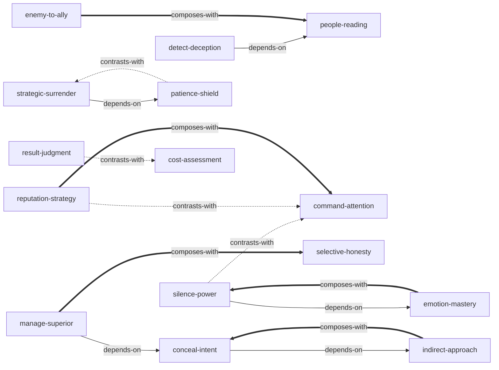

# 权力的48条法则

由《权力的48条法则》（*The 48 Laws of Power*）蒸馏出的一组**可被 AI Agent 调用的技能**（Skills）。

> 权力是一场文明化的战争——你必须学会用迂回、隐蔽、耐心的手段操控人心与局势，而非依赖暴力或直白的力量对抗。
> 直觉告诉你展示实力、直接表达、快速行动，而这恰恰是通向失败的捷径。
> 本书把3000年历史中的权力博弈提炼成48条法则，本项目从中蒸馏出 15 个原子化技能，让 Agent 能在真实场景里调用它们。

---

## 来源

| | |
|---|---|
| **书名** | 权力的48条法则（*The 48 Laws of Power*） |
| **作者** | 罗伯特·格林（Robert Greene） |
| **出版** | 1998（英文原版）/ 2007（中文译本） |
| **蒸馏工具** | cangjie-skill（仓颉：把长内容蒸馏成可调用技能的流水线） |
| **蒸馏方法** | RIA-TV++（整书理解 → 并行提取 → 三重验证 → RIA++ 构造 → 链接 → 压力测试 → 交付） |

---

## 15 个技能

### 自我管理

- [`emotion-mastery`](skills/emotion-mastery/SKILL.md) — **情绪控制框架**：控制愤怒/爱/恐惧三大致命情绪，情绪反应=失控=失去权力
- [`patience-shield`](skills/patience-shield/SKILL.md) — **耐心盾牌**：耐心不是被动等待而是主动防御技能，防止犯下愚蠢大错
- [`cost-assessment`](skills/cost-assessment/SKILL.md) — **代价评估**：不以收益判断而以代价判断，含精神宁静和时间成本

### 信息与表达策略

- [`conceal-intent`](skills/conceal-intent/SKILL.md) — **隐藏意图**：五种烟幕系统化隐藏真实意图，最高明的骗子用诚实掩护欺骗
- [`silence-power`](skills/silence-power/SKILL.md) — **沉默威慑**：说得越少越有权，沉默迫使对方自我防御暴露弱点
- [`selective-honesty`](skills/selective-honesty/SKILL.md) — **选择性诚实**：用小真话缴械对方防备，诚实是权力工具而非道德选择
- [`detect-deception`](skills/detect-deception/SKILL.md) — **识别伪装**：识别"天真/道德/不玩权术"伪装下的权力策略

### 关系与权力博弈

- [`manage-superior`](skills/manage-superior/SKILL.md) — **向上管理**：上司的不安全感决定你的隐藏程度，四种伪装方法
- [`enemy-to-ally`](skills/enemy-to-ally/SKILL.md) — **化敌为友**：敌人比朋友更忠诚，忘恩负义是人性规律非道德缺陷
- [`people-reading`](skills/people-reading/SKILL.md) — **识人术**：不区分"应研究的"和"可信赖的"——研究每一个人

### 战略行动

- [`indirect-approach`](skills/indirect-approach/SKILL.md) — **迂回前进**：直接路线本身就是陷阱，权力必须迂回获取
- [`strategic-surrender`](skills/strategic-surrender/SKILL.md) — **战略示弱**：示弱是策略性欺骗，投降是等待时机的手段
- [`result-judgment`](skills/result-judgment/SKILL.md) — **结果导向**：道德判断是聚积力量的借口，只看行动结果

### 形象与影响力

- [`reputation-strategy`](skills/reputation-strategy/SKILL.md) — **声誉策略**：声誉是攻防武器：可建立、可攻击对手、可漂白
- [`command-attention`](skills/command-attention/SKILL.md) — **引人注目**：被人攻击好过无人问津，任何知名度都带权力

---

## 技能之间的引用关系



图例：`-->` 依赖 · `-.->` 二选一 · `===>` 常配合使用

**推荐学习顺序**（从叶子节点向上）：`emotion-mastery` → `patience-shield` → `cost-assessment` → `result-judgment` → `indirect-approach` → `people-reading` → `conceal-intent` → `silence-power` → `selective-honesty` → `strategic-surrender` → `enemy-to-ally` → `detect-deception` → `manage-superior` → `reputation-strategy` → `command-attention`

---

## 安装

每个技能目录都包含 `SKILL.md`（+ `test-prompts.json` 测试产物），可直接复制到宿主环境：

```bash
# Claude Code（用户级，所有项目可用）
cp -r skills/* ~/.claude/skills/

# 或 Claude Code（项目级）
cp -r skills/* <project>/.claude/skills/

# Trae（项目级）
cp -r skills/* <project>/.trae/skills/

# Cursor（项目级）
cp -r skills/* <project>/.cursor/skills/
```

---

## 完整文档

`docs/` 目录保留了完整的蒸馏产物与审计轨迹：

| 文件 | 说明 |
|---|---|
| [`DIGEST.md`](docs/DIGEST.md) | 面向读者的精华长文（不读全书看这篇，约 8000 字） |
| [`GLOSSARY.md`](docs/GLOSSARY.md) | 17 个共享术语词典（权力/迂回/烟幕/声誉/朝臣…） |
| [`INDEX.md`](docs/INDEX.md) | 技能总览 + 引用图 + 学习顺序 |
| [`BOOK_OVERVIEW.md`](docs/BOOK_OVERVIEW.md) | 整书理解（结构/解释/批判/应用潜力） |
| [`verified.md`](docs/verified.md) | 三重验证结果（151 候选 → 15 通过） |
| [`test-results.md`](docs/test-results.md) | 压力测试汇总（90 条盲测，100% 通过） |
| [`PIPELINE_STATE.md`](docs/PIPELINE_STATE.md) | 流水线各阶段状态 |
| [`candidates/`](docs/candidates/) | 5 路提取的原始候选池（框架/原则/案例/反例/术语） |
| [`rejected/`](docs/rejected/) | 被淘汰候选的去向与原因 |

---

## 目录结构

```text
power-48-laws/
├── README.md
├── skills/                      # 15 个可安装技能（核心交付物）
│   └── <skill-slug>/
│       ├── SKILL.md             # 技能定义（R/I/A1/A2/E/B 六段）
│       └── test-prompts.json    # 触发/诱饵测试集
└── docs/                        # 蒸馏文档与审计轨迹
    ├── DIGEST.md / GLOSSARY.md / INDEX.md
    ├── BOOK_OVERVIEW.md / verified.md / test-results.md
    ├── PIPELINE_STATE.md
    ├── candidates/              # 框架/原则/案例/反例/术语 候选池
    └── rejected/                # 淘汰候选及原因
```

---

## 关于内容与版权

本项目是**方法论蒸馏产物**，不含原书全文：

- 每个技能对原书的引用严格控制在 **≤150 字/段**，属于评论与研究目的的合理引用范畴；
- 原文的版权归原作者罗伯特·格林及中文译本出版社所有；
- 建议购买正版书籍配合使用。

---

## 源文本说明

原始 EPUB 转换为文本时存在已知问题：

- 全文约 2380 万字符，但存在大量重复内容（EPUB 结构问题）
- 有效内容范围：前言 + 法则 1-6 的完整正文
- 法则 7-48 仅有标题和一句话摘要
- 候选提取基于可用文本完成，后续如获取完整文本可补充

---

## 如何重新生成

本项目由 cangjie-skill（仓颉蒸馏流水线）自动生成。若要复现或调整：

1. 准备书籍文本（从 EPUB 提取为 `full-text.txt`）
2. 运行 RIA-TV++ 流水线（阶段 0–5，详见 `docs/PIPELINE_STATE.md`）
3. 通过三重验证 + 压力测试的单元会被构造为独立技能并安装

如需让技能持续进化，可喂给 `darwin-skill`：`darwin evolve power-48-laws/`
