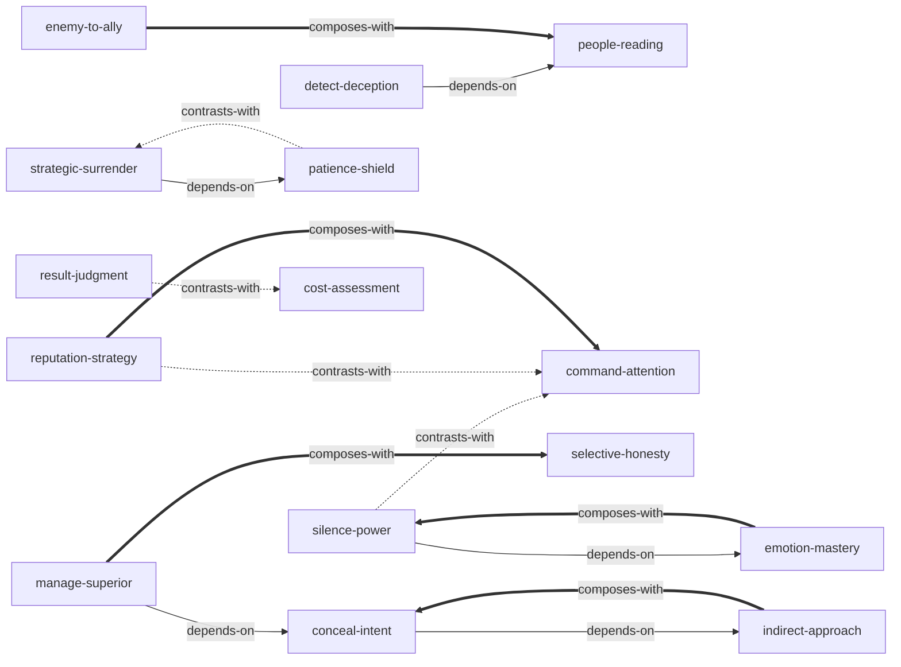

# 《权力的48条法则》 — Skill Index

> 本书由 cangjie-skill 蒸馏, 共产出 **15** 个 skills。
> 处理时间: 2026-09-16

## 关于这本书

- **作者**: 罗伯特·格林 (Robert Greene)
- **出版年**: 1998 (中文译本 2007)
- **一句话主旨**: 权力是一场文明化的战争——你必须学会用迂回、隐蔽、耐心的手段操控人心与局势，而非依赖暴力或直白的力量对抗。
- **整书理解**: 见 [BOOK_OVERVIEW.md](./BOOK_OVERVIEW.md)
- **精华长文** (不读全书看这篇): [DIGEST.md](./DIGEST.md) (~8000字)
- **术语词典**: [GLOSSARY.md](./GLOSSARY.md)

---

## Skill 列表 (按主题分组)

### 自我管理 (Self-Management)

- [`emotion-mastery`](../skills/emotion-mastery/SKILL.md) — 控制愤怒/爱/恐惧三大致命情绪，情绪反应=失控=失去权力
- [`patience-shield`](../skills/patience-shield/SKILL.md) — 耐心不是被动等待而是主动防御技能，防止犯下愚蠢大错
- [`cost-assessment`](../skills/cost-assessment/SKILL.md) — 不以收益判断而以代价判断，含精神宁静和时间成本

### 信息与表达策略 (Information & Expression)

- [`conceal-intent`](../skills/conceal-intent/SKILL.md) — 五种烟幕系统化隐藏真实意图，最高明的骗子用诚实掩护欺骗
- [`silence-power`](../skills/silence-power/SKILL.md) — 说得越少越有权，沉默迫使对方自我防御暴露弱点
- [`selective-honesty`](../skills/selective-honesty/SKILL.md) — 用小真话缴械对方防备，诚实是权力工具而非道德选择
- [`detect-deception`](../skills/detect-deception/SKILL.md) — 识别"天真/道德/不玩权术"伪装下的权力策略

### 关系与权力博弈 (Relationships & Power Play)

- [`manage-superior`](../skills/manage-superior/SKILL.md) — 上司的不安全感决定你的隐藏程度，四种伪装方法
- [`enemy-to-ally`](../skills/enemy-to-ally/SKILL.md) — 敌人比朋友更忠诚，忘恩负义是人性规律非道德缺陷
- [`people-reading`](../skills/people-reading/SKILL.md) — 不区分"应研究的"和"可信赖的"——研究每一个人

### 战略行动 (Strategic Action)

- [`indirect-approach`](../skills/indirect-approach/SKILL.md) — 直接路线本身就是陷阱，权力必须迂回获取
- [`strategic-surrender`](../skills/strategic-surrender/SKILL.md) — 示弱是策略性欺骗，投降是等待时机的手段
- [`result-judgment`](../skills/result-judgment/SKILL.md) — 道德判断是聚积力量的借口，只看行动结果

### 形象与影响力 (Image & Influence)

- [`reputation-strategy`](../skills/reputation-strategy/SKILL.md) — 声誉是攻防武器：可建立、可攻击对手、可漂白
- [`command-attention`](../skills/command-attention/SKILL.md) — 被人攻击好过无人问津，任何知名度都带权力

---

## 引用图



图例:
- `-->`  depends-on (A 的使用前提是先理解 B)
- `-.->` contrasts-with (A 和 B 是两种可选方案，看情境选一)
- `===>` composes-with (A 和 B 经常配合使用)

---

## 推荐学习顺序

从依赖图的叶子节点开始，向上推进：

### 第一层 — 基础 (无前置依赖)

1. **emotion-mastery** — 最基础。情绪控制是所有权力策略的前提：无法控制自己=无法控制局势
2. **patience-shield** — 基础。耐心是防御技能，防止在策略执行中犯愚蠢大错
3. **cost-assessment** — 基础。代价评估是决策框架，在任何行动前先判断代价
4. **result-judgment** — 基础。结果导向是判断方法论，剥离道德标签看行动结果
5. **indirect-approach** — 基础方法论。迂回是全书的元理论，理解后才能看懂其他策略为何要"隐藏"
6. **people-reading** — 基础分析框架。研究他人是所有关系策略的前提

### 第二层 — 进阶 (依赖第一层)

7. **conceal-intent** — 依赖 indirect-approach。迂回的具体战术应用：隐藏意图+五种烟幕
8. **silence-power** — 依赖 emotion-mastery。情绪控制的外在表现：少说话=不暴露
9. **selective-honesty** — 依赖 conceal-intent。隐藏意图的变体：用小真话来缴械
10. **strategic-surrender** — 依赖 patience-shield。耐心的主动应用：假装退让+等待时机
11. **enemy-to-ally** — 依赖 people-reading。识人的行动应用：转化对手为盟友
12. **detect-deception** — 依赖 people-reading。识人的检测应用：识别伪装天真的人

### 第三层 — 综合 (依赖第一+二层)

13. **manage-superior** — 依赖 conceal-intent。隐藏意图在上下级关系中的具体化：不盖过上司光芒
14. **reputation-strategy** — 综合。长期形象经营，需要结合 conceal-intent 和 people-reading
15. **command-attention** — 综合。短期注意力获取，与 reputation-strategy 互补

---

## 安装使用

本目录是构建产物，宿主不会从这里加载 skill。要让 agent 真正调用，把 skill 目录复制到宿主的 skills 目录：

```powershell
# TRAE 用户级 (所有项目可用)
Copy-Item -Recurse e:\solo\books\power-48-laws\indirect-approach e:\solo\.trae\skills\

# 或批量安装全部 15 个
Get-ChildItem e:\solo\books\power-48-laws\ -Directory | Where-Object { $_.Name -notin @('candidates','rejected') } | ForEach-Object { Copy-Item -Recurse $_.FullName e:\solo\.trae\skills\ }
```

---

## 接入 darwin-skill

所有 skill 均带有 `test-prompts.json` (darwin-skill 兼容格式)，可直接接入自动进化：

```
darwin evolve books/power-48-laws/
```

---

## 审计轨迹

- 候选单元池: [candidates/](./candidates/)
- 被淘汰的候选 (含原因): [rejected/](./rejected/)
- 三重验证通过名单: [verified.md](./verified.md)
- BOOK_OVERVIEW: [BOOK_OVERVIEW.md](./BOOK_OVERVIEW.md)
- 流水线状态: [PIPELINE_STATE.md](./PIPELINE_STATE.md)
