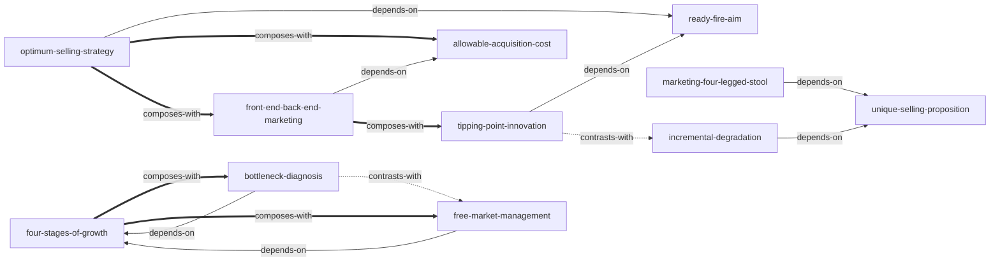

# ready-fire-aim-skills

由《Ready, Fire, Aim: Zero to $100 Million in No Time Flat》蒸馏出的一组**可被 AI Agent 调用的创业与营销技能**（Skills）。

> 新创企业最大的风险不是犯错，而是花太多时间计划、却从未验证市场。
> 本书主张以「先行动、再瞄准」的快速试错哲学，穿越企业从婴儿期到成年期的四个成长阶段。
> 本项目把其中的方法论提炼成 11 个原子化技能，让 Agent 能在真实场景里调用它们。

---

## 来源

| | |
|---|---|
| **书名** | Ready, Fire, Aim: Zero to $100 Million in No Time Flat |
| **作者** | Michael Masterson |
| **出版** | 2008 |
| **蒸馏工具** | cangjie-skill（仓颉：把长内容蒸馏成可调用技能的流水线） |
| **蒸馏方法** | RIA-TV++（整书理解 → 并行提取 → 三重验证 → RIA++ 构造 → 链接 → 压力测试 → 交付） |

---

## 11 个技能

### 阶段一 · 行动与销售验证

- [`ready-fire-aim`](skills/ready-fire-aim/SKILL.md) — **先行动再瞄准**：打破「准备完美才开始」的瘫痪，快速试错框架
- [`optimum-selling-strategy`](skills/optimum-selling-strategy/SKILL.md) — **最优销售策略（OSS）**：同时测试渠道/产品/定价/主张四变量，找到可重复获客的组合
- [`allowable-acquisition-cost`](skills/allowable-acquisition-cost/SKILL.md) — **可承受获客成本（AAC）**：用客户终身毛利倒推获客预算上限，把前端亏损变成有边界的投资

### 阶段二 · 营销与产品创新

- [`front-end-back-end-marketing`](skills/front-end-back-end-marketing/SKILL.md) — **前后端营销**：把产品线拆成「获客品」与「利润品」，设计客户终身价值路径
- [`unique-selling-proposition`](skills/unique-selling-proposition/SKILL.md) — **独特卖点（USP）**：在拥挤市场中找到「看起来独特、对客户有用、一句话能说清」的定位
- [`marketing-four-legged-stool`](skills/marketing-four-legged-stool/SKILL.md) — **营销四脚凳**：用 Big Idea / Big Benefit / Big Promise / Proof 检查营销活动是否站得住
- [`tipping-point-innovation`](skills/tipping-point-innovation/SKILL.md) — **临界点创新**：在已有趋势上做 80% 熟悉 + 20% 新意的微创新

### 阶段三/四 · 组织与成长诊断

- [`four-stages-of-growth`](skills/four-stages-of-growth/SKILL.md) — **四阶段成长**：判断企业处于婴儿期/童年期/青春期/成年期，并匹配正确优先级
- [`free-market-management`](skills/free-market-management/SKILL.md) — **自由市场管理**：用利润中心、内部自由市场与信息透明降低办公室政治
- [`bottleneck-diagnosis`](skills/bottleneck-diagnosis/SKILL.md) — **瓶颈诊断**：通过时间审计与团队访谈，判断创始人是否已成为最大瓶颈
- [`incremental-degradation`](skills/incremental-degradation/SKILL.md) — **渐进退化防御**：把「维护」重新定义为持续小改进，防止产品与 USP 随时间退化

---

## 技能之间的引用关系



图例：`-->` 依赖 · `-.->` 二选一 · `==>` 常配合使用

**推荐学习顺序**（从叶子节点向上）：`ready-fire-aim` → `allowable-acquisition-cost` / `unique-selling-proposition` → `optimum-selling-strategy` → `front-end-back-end-marketing` → `marketing-four-legged-stool` → `tipping-point-innovation` → `incremental-degradation` → `four-stages-of-growth` → `bottleneck-diagnosis` / `free-market-management`

---

## 安装

每个技能目录都包含 `SKILL.md` + 测试产物（`test-prompts.json` / `test-results.md` / `test-results-blind.md`），可直接复制到宿主环境：

```bash
# Claude Code（用户级，所有项目可用）
cp -r skills/* ~/.claude/skills/

# 或 Claude Code（项目级）
cp -r skills/* <project>/.claude/skills/

# Trae（项目级）
cp -r skills/* <project>/.trae/skills/

# Cursor（项目级）
cp -r skills/* <project>/.cursor/skills/
```

---

## 完整文档

`docs/` 目录保留了完整的蒸馏产物与审计轨迹：

| 文件 | 说明 |
|---|---|
| [`DIGEST.md`](docs/DIGEST.md) | 面向读者的精华长文（不读全书看这篇，约 5600 字） |
| [`GLOSSARY.md`](docs/GLOSSARY.md) | 共享术语词典（OSS / AAC / 前端后端 / 四阶段…） |
| [`INDEX.md`](docs/INDEX.md) | 技能总览 + 引用图 + 学习顺序 |
| [`BOOK_OVERVIEW.md`](docs/BOOK_OVERVIEW.md) | 整书理解（结构/解释/批判/应用潜力） |
| [`verified.md`](docs/verified.md) | 三重验证结果（123 候选 → 11 通过） |
| [`PIPELINE_STATE.md`](docs/PIPELINE_STATE.md) | 流水线各阶段状态 |
| [`candidates/`](docs/candidates/) | 5 个提取器的原始候选池（框架/原则/案例/反例/术语） |
| [`rejected/`](docs/rejected/) | 78 个被淘汰的候选单元及原因 |

---

## 目录结构

```text
ready-fire-aim-skills/
├── README.md
├── skills/                      # 11 个可安装技能（核心交付物）
│   └── <skill-slug>/
│       ├── SKILL.md             # 技能定义（R/I/A1/A2/E/B 六段）
│       ├── test-prompts.json    # 触发/诱饵测试集
│       ├── test-results.md      # 压力测试结果
│       └── test-results-blind.md
└── docs/                        # 蒸馏文档与审计轨迹
    ├── DIGEST.md / GLOSSARY.md / INDEX.md
    ├── BOOK_OVERVIEW.md / verified.md / PIPELINE_STATE.md
    ├── candidates/              # 候选池
    └── rejected/                # 淘汰单元（含原因）
```

---

## 关于内容与版权

本项目是**方法论蒸馏产物**，不含原书全文：

- 每个技能对原书的引用严格控制在 **≤150 字/段**（英文 ≤100 词），属于合理引用范畴；
- 原文版权归原作者 Michael Masterson 及出版社所有；
- 建议购买正版书籍配合使用。

---

## 如何重新生成

本项目由 cangjie-skill（仓颉蒸馏流水线）自动生成。若要复现或调整：

1. 准备书籍文本（EPUB → 分块文本）
2. 运行 RIA-TV++ 流水线（阶段 0–5，详见 `docs/PIPELINE_STATE.md`）
3. 通过三重验证 + 压力测试的单元会被构造为独立技能并安装

如需让技能持续进化，可喂给 `darwin-skill`：`darwin evolve ready-fire-aim-skills/`
