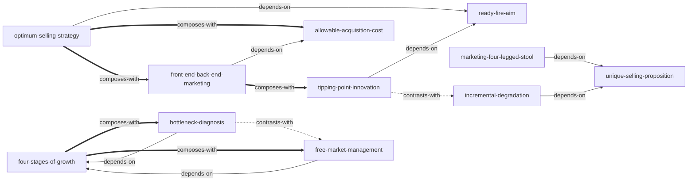

# 《Ready, Fire, Aim》 — Skill Index

> 本书由 cangjie-skill 蒸馏，共产出 **11** 个 skills。
> 处理时间: 2026-08-15

## 关于这本书

- **作者**: Michael Masterson
- **出版年**: 2008
- **一句话主旨**: 创业者应摆脱“准备—瞄准—开火”的完美主义顺序，以“Ready, Fire, Aim”的快速行动哲学穿越企业从婴儿期到成年期的四个成长阶段，逐步从销售员进化为管理者与投资者。
- **整书理解**: 见 [BOOK_OVERVIEW.md](./BOOK_OVERVIEW.md)
- **术语词典**: 见 [GLOSSARY.md](./GLOSSARY.md)

---

## Skill 列表 (按主题分组)

### 阶段一：行动与销售验证

- [`ready-fire-aim`](./ready-fire-aim/SKILL.md) — 先行动再瞄准的快速试错框架，打破“准备完美才开始”的 paralysis。
- [`optimum-selling-strategy`](./optimum-selling-strategy/SKILL.md) — 同时测试渠道、产品、定价、主张四个变量，找到可重复获客的 OSS。
- [`allowable-acquisition-cost`](./allowable-acquisition-cost/SKILL.md) — 用客户终身毛利倒推可承受获客成本，把前端亏损变成有边界的投资。

### 阶段二：营销与产品创新

- [`front-end-back-end-marketing`](./front-end-back-end-marketing/SKILL.md) — 把产品线拆成“获客品”与“利润品”，设计完整的客户终身价值路径。
- [`unique-selling-proposition`](./unique-selling-proposition/SKILL.md) — 在拥挤市场中找到“看起来独特、对客户有用、一句话能说清”的定位。
- [`marketing-four-legged-stool`](./marketing-four-legged-stool/SKILL.md) — 用 Big Idea / Big Benefit / Big Promise / Proof 四脚凳检查营销活动是否站得住。
- [`tipping-point-innovation`](./tipping-point-innovation/SKILL.md) — 在已有趋势上做 80% 熟悉 + 20% 新意的微创新，成为“最后一滴水”。

### 阶段三/四：组织与成长诊断

- [`four-stages-of-growth`](./four-stages-of-growth/SKILL.md) — 判断企业处于婴儿期/童年期/青春期/成年期，并匹配正确优先级。
- [`free-market-management`](./free-market-management/SKILL.md) — 用利润中心、内部自由市场与信息透明来降低办公室政治。
- [`bottleneck-diagnosis`](./bottleneck-diagnosis/SKILL.md) — 通过时间审计与团队访谈，判断创始人是否已成为最大瓶颈。
- [`incremental-degradation`](./incremental-degradation/SKILL.md) — 把“维护”重新定义为持续小改进，防止产品与 USP 随时间渐进退化。

---

## 引用图



图例:
- `-->` depends-on
- `-.->` contrasts-with
- `==>` composes-with

---

## 推荐学习顺序

(从依赖图的叶子节点开始，向上)

1. **ready-fire-aim** — 最基础，没有前置；先建立“准备足够即可开火”的行动哲学。
2. **allowable-acquisition-cost** — 叶子节点；学会用客户终身毛利倒推获客预算上限。
3. **unique-selling-proposition** — 叶子节点；学会为产品切出可传播的独特位置。
4. **optimum-selling-strategy** — 依赖 ready-fire-aim；把行动哲学变成四变量系统测试。
5. **front-end-back-end-marketing** — 依赖 allowable-acquisition-cost，与 optimum-selling-strategy 互补；设计“前端获客 → 后端盈利”的产品路径。
6. **marketing-four-legged-stool** — 依赖 unique-selling-proposition；把 USP 包装成能卖货的 campaign。
7. **tipping-point-innovation** — 依赖 ready-fire-aim，与 front-end-back-end-marketing 配合；在已有趋势上做微创新。
8. **incremental-degradation** — 依赖 unique-selling-proposition，与 tipping-point-innovation 形成对比；维护现有产品的 USP 不退化。
9. **four-stages-of-growth** — 诊断框架，无前置；判断企业当前阶段与核心任务。
10. **bottleneck-diagnosis** — 依赖 four-stages-of-growth；用于 Stage Three，判断创始人是否成为瓶颈。
11. **free-market-management** — 依赖 four-stages-of-growth；用于 Stage Three，解决组织政治与激励扭曲。

---

## 安装使用

本目录是构建产物，宿主不会从这里加载 skill。要让 agent 真正调用，把 skill 目录复制到宿主的 skills 目录:

```bash
# 用户级 (所有项目可用)
cp -r ready-fire-aim ~/.claude/skills/
cp -r optimum-selling-strategy ~/.claude/skills/
cp -r allowable-acquisition-cost ~/.claude/skills/
cp -r front-end-back-end-marketing ~/.claude/skills/
cp -r unique-selling-proposition ~/.claude/skills/
cp -r marketing-four-legged-stool ~/.claude/skills/
cp -r tipping-point-innovation ~/.claude/skills/
cp -r four-stages-of-growth ~/.claude/skills/
cp -r free-market-management ~/.claude/skills/
cp -r bottleneck-diagnosis ~/.claude/skills/
cp -r incremental-degradation ~/.claude/skills/

# 或项目级
cp -r ready-fire-aim <project>/.claude/skills/    # Claude Code
cp -r ready-fire-aim <project>/.cursor/skills/    # Cursor
```

---

## 接入 darwin-skill

所有 skill 均带有 `test-prompts.json` (darwin-skill 兼容格式)，可直接接入自动进化:

```
darwin evolve books/ready-fire-aim/
```

---

## 审计轨迹

- 候选单元池: [candidates/](./candidates/)
- 被淘汰的候选 (含原因): [rejected/](./rejected/)
- 三重验证通过的候选池: [verified.md](./verified.md)
- 整书理解: [BOOK_OVERVIEW.md](./BOOK_OVERVIEW.md)
- 术语词典: [GLOSSARY.md](./GLOSSARY.md)
