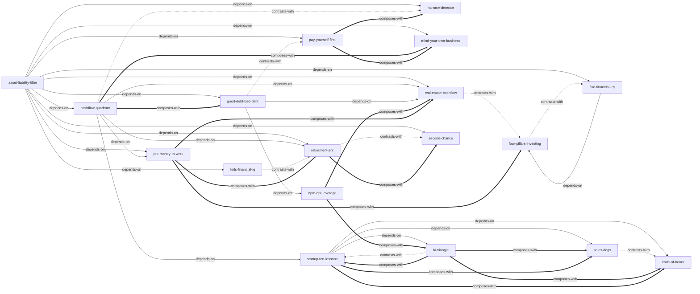

# 富爸爸穷爸爸系列

由《富爸爸穷爸爸系列（共 32 册）》蒸馏出的一组**可被 AI Agent 调用的技能**（Skills）。

> 通过转变金钱观、持续买入「能把钱放进口袋的资产」、从 E/S 象限迁往 B/I 象限，
> 普通人可以跳出「为钱工作」的老鼠赛跑，实现不依赖工资的财务自由。
> 本项目把清崎的「财商工具箱」提炼成 18 个原子化技能，让 Agent 能在真实财务决策场景里调用它们。

---

## 来源

| | |
|---|---|
| **书名** | 富爸爸穷爸爸系列（共 32 册） |
| **作者** | 罗伯特·T·清崎（Robert T. Kiyosaki） |
| **出版** | 2021 套装（系列出版时间跨度 1997–2020） |
| **蒸馏工具** | cangjie-skill（仓颉：把长内容蒸馏成可调用技能的流水线） |
| **蒸馏方法** | RIA-TV++（整书理解 → 并行提取 → 三重验证 → RIA++ 构造 → 链接 → 压力测试 → 交付） |

---

## 18 个技能

### 基础层：先建立现金流语言

- [`asset-liability-filter`](skills/asset-liability-filter/SKILL.md) — **资产与负债区分法**：按现金流方向判断一笔钱/物品是资产还是负债
- [`cashflow-quadrant`](skills/cashflow-quadrant/SKILL.md) — **现金流象限（ESBI）**：判断自己处于雇员/自由职业/企业主/投资者哪一象限
- [`rat-race-detector`](skills/rat-race-detector/SKILL.md) — **老鼠赛跑识别与跳出**：识别「加薪即增支」的财务循环

### 纪律层：管理现金流与债务

- [`pay-yourself-first`](skills/pay-yourself-first/SKILL.md) — **先支付自己**：工资到账先投资自己，再付账单
- [`mind-your-own-business`](skills/mind-your-own-business/SKILL.md) — **关注自己的事业**：把精力从「工作」转向「自己的资产项」
- [`good-debt-bad-debt`](skills/good-debt-bad-debt/SKILL.md) — **良性债务 vs 不良债务**：判断一笔债是在增加资产还是在消耗现金流

### 能力层：提升财商与杠杆

- [`five-financial-iqs`](skills/five-financial-iqs/SKILL.md) — **五种财商**：赚、守、预算、杠杆、信息五维自评与修炼
- [`opm-opt-leverage`](skills/opm-opt-leverage/SKILL.md) — **OPM/OPT 杠杆模型**：用别人的钱和时间放大资产现金流

### 投资层：让钱工作

- [`put-money-to-work`](skills/put-money-to-work/SKILL.md) — **给你的钱找一份工作**：为资本分配明确的现金流任务
- [`four-pillars-investing`](skills/four-pillars-investing/SKILL.md) — **股票投资四柱法**：基本面/技术面/现金流策略/风险管理
- [`real-estate-cashflow`](skills/real-estate-cashflow/SKILL.md) — **房地产投资现金流分析**：先算净现金流与现金回报率

### 创业层：建立 B 型企业

- [`bi-triangle`](skills/bi-triangle/SKILL.md) — **B-I 三角形（企业八要素）**：使命/团队/领导力/产品/法律/系统/沟通/现金流
- [`startup-ten-lessons`](skills/startup-ten-lessons/SKILL.md) — **创业前的准备与目标设定**：从雇员思维转向企业主思维
- [`sales-dogs`](skills/sales-dogs/SKILL.md) — **销售狗模型**：识别五种销售人格并补短板
- [`code-of-honor`](skills/code-of-honor/SKILL.md) — **荣誉守则 / 团队建设**：把价值观变成可执行、可问责的规则

### 人生层：危机与传承

- [`retirement-ark`](skills/retirement-ark/SKILL.md) — **退休方舟 / 财富大趋势**：构建能抵御系统性风险的资产结构
- [`second-chance`](skills/second-chance/SKILL.md) — **第二次致富机会**：把失败与危机转化为翻盘机会
- [`kids-financial-iq`](skills/kids-financial-iq/SKILL.md) — **儿童财商教育**：在家庭中培养孩子的财富基因

---

## 技能之间的引用关系



图例：`-->` 依赖 · `-.->` 互补或对照 · `===>` 常组合使用

**推荐学习顺序**：`asset-liability-filter` → `cashflow-quadrant` → `rat-race-detector` → `pay-yourself-first` → `mind-your-own-business` → `good-debt-bad-debt` → `five-financial-iqs` → `opm-opt-leverage` → `put-money-to-work` → `real-estate-cashflow` / `four-pillars-investing` → `bi-triangle` → `startup-ten-lessons` → `sales-dogs` → `code-of-honor` → `retirement-ark` → `second-chance` → `kids-financial-iq`

---

## 安装

每个技能目录都包含 `SKILL.md`（+ `test-prompts.json` / `test-results.md` 测试产物），可直接复制到宿主环境：

```bash
# Claude Code（用户级，所有项目可用）
cp -r skills/* ~/.claude/skills/

# 或 Claude Code（项目级）
cp -r skills/* <project>/.claude/skills/

# Trae（项目级）
cp -r skills/* <project>/.trae/skills/

# Cursor（项目级）
cp -r skills/* <project>/.cursor/skills/
```

---

## 完整文档

`docs/` 目录保留了完整的蒸馏产物与审计轨迹：

| 文件 | 说明 |
|---|---|
| [`DIGEST.md`](docs/DIGEST.md) | 面向读者的精华长文（不读全书看这篇） |
| [`GLOSSARY.md`](docs/GLOSSARY.md) | 共享术语词典（现金流象限/资产/负债/OPM/OPT…） |
| [`INDEX.md`](docs/INDEX.md) | 技能总览 + 引用图 + 学习顺序 |
| [`BOOK_OVERVIEW.md`](docs/BOOK_OVERVIEW.md) | 整书理解（结构/解释/批判/应用潜力） |
| [`verified.md`](docs/verified.md) | 三重验证结果（候选池 → 18 通过） |
| [`rejected.md`](docs/rejected.md) | 被淘汰的候选及原因 |
| [`PIPELINE_STATE.md`](docs/PIPELINE_STATE.md) | 流水线各阶段状态 |
| [`TEST_REPORT.md`](docs/TEST_REPORT.md) | 压力测试静态审查报告 |
| [`candidates/`](docs/candidates/) | 5 个提取器的原始候选池 |

---

## 目录结构

```text
rich-dad-poor-dad-series/
├── README.md
├── skills/                      # 18 个可安装技能（核心交付物）
│   └── <skill-slug>/
│       ├── SKILL.md             # 技能定义（R/I/A1/A2/E/B 六段）
│       ├── test-prompts.json    # 触发/诱饵测试集
│       └── test-results.md      # 压力测试结果
└── docs/                        # 蒸馏文档与审计轨迹
    ├── DIGEST.md / GLOSSARY.md / INDEX.md
    ├── BOOK_OVERVIEW.md / verified.md / rejected.md
    ├── PIPELINE_STATE.md / TEST_REPORT.md
    └── candidates/              # 框架/原则/案例/反例/术语 候选池
```

---

## 关于内容与版权

本项目是**方法论蒸馏产物**，不含原书全文：

- 每个技能对原书的引用严格控制在**≤150 字/段**，属于合理引用范畴；
- 原文的版权归原作者罗伯特·T·清崎及出版社所有；
- 建议购买正版书籍配合使用。

---

## 免责声明

这些 skills 基于清崎的财商方法论蒸馏而成，属于个人理财与投资的教育性框架，**不构成任何投资建议**。其中关于杠杆、房地产、股票等观点带有作者的时代与立场局限，请结合自身风险承受能力、当地法规与专业顾问意见审慎使用。

---

## 如何重新生成

本项目由 cangjie-skill（仓颉蒸馏流水线）自动生成。若要复现或调整：

1. 准备书籍文本（`fulltext.txt`，从 EPUB 提取）
2. 运行 RIA-TV++ 流水线（阶段 0–5，详见 `docs/PIPELINE_STATE.md`）
3. 通过三重验证 + 压力测试的单元会被构造为独立技能并安装

如需让技能持续进化，可喂给 `darwin-skill`：`darwin evolve rich-dad-poor-dad-series/`
