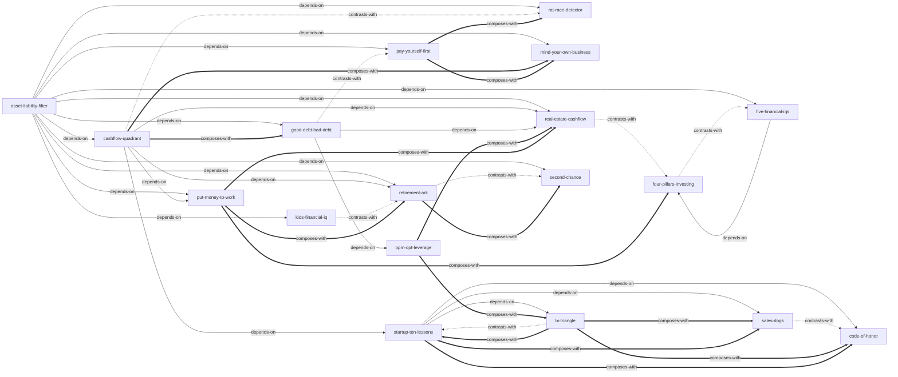

# 《富爸爸穷爸爸系列（共32册）》— Skill Index

> 本系列由 cangjie-skill 蒸馏，共产出 **18** 个 skills。
> 处理时间：2026-08-23

---

## 关于这套书

- **书名**：《富爸爸穷爸爸系列（共32册）》
- **作者**：罗伯特·T·清崎（Robert T. Kiyosaki）
- **出版年**：2021 年套装（系列出版时间跨度 1997–2020）
- **一句话主旨**：通过转变金钱观、持续买入“能把钱放进口袋的资产”、从 E/S 象限迁往 B/I 象限，普通人可以跳出“为钱工作”的老鼠赛跑，实现不依赖工资的财务自由。
- **整书理解**：见 [BOOK_OVERVIEW.md](./BOOK_OVERVIEW.md)
- **精华长文**：见 [DIGEST.md](./DIGEST.md)
- **共享术语词典**：见 [GLOSSARY.md](./GLOSSARY.md)
- **使用指南**：见 [README.md](./README.md)
- **验证结果**：见 [verified.md](./verified.md)

---

## Skill 列表（按学习路径分组）

### 1. 基础层：先建立现金流语言

- [`asset-liability-filter`](../skills/asset-liability-filter/SKILL.md) — 资产与负债区分法：按现金流方向判断一笔钱/物品是资产还是负债
- [`cashflow-quadrant`](../skills/cashflow-quadrant/SKILL.md) — 现金流象限（ESBI）：判断自己处于雇员/自由职业/企业主/投资者哪一象限
- [`rat-race-detector`](../skills/rat-race-detector/SKILL.md) — 老鼠赛跑识别与跳出：识别“加薪即增支”的财务循环

### 2. 纪律层：管理现金流与债务

- [`pay-yourself-first`](../skills/pay-yourself-first/SKILL.md) — 先支付自己：工资到账先投资自己，再付账单
- [`mind-your-own-business`](../skills/mind-your-own-business/SKILL.md) — 关注自己的事业 / 资产项优先：把精力从“工作”转向“自己的资产项”
- [`good-debt-bad-debt`](../skills/good-debt-bad-debt/SKILL.md) — 良性债务 vs 不良债务：判断一笔债是在增加资产还是在消耗现金流

### 3. 能力层：提升财商与杠杆

- [`five-financial-iqs`](../skills/five-financial-iqs/SKILL.md) — 五种财商：赚、守、预算、杠杆、信息五维自评与修炼
- [`opm-opt-leverage`](../skills/opm-opt-leverage/SKILL.md) — OPM/OPT 杠杆模型：用别人的钱和时间放大资产现金流

### 4. 投资层：让钱工作

- [`put-money-to-work`](../skills/put-money-to-work/SKILL.md) — 给你的钱找一份工作：为资本分配明确的现金流任务
- [`four-pillars-investing`](../skills/four-pillars-investing/SKILL.md) — 股票投资四柱法：基本面/技术面/现金流策略/风险管理
- [`real-estate-cashflow`](../skills/real-estate-cashflow/SKILL.md) — 房地产投资现金流分析：先算净现金流与现金回报率

### 5. 创业层：建立 B 型企业

- [`bi-triangle`](../skills/bi-triangle/SKILL.md) — B-I 三角形（企业八要素）：使命/团队/领导力/产品/法律/系统/沟通/现金流
- [`startup-ten-lessons`](../skills/startup-ten-lessons/SKILL.md) — 创业前的准备与目标设定：从雇员思维转向企业主思维
- [`sales-dogs`](../skills/sales-dogs/SKILL.md) — 销售沟通与销售狗模型：识别五种销售人格并补短板
- [`code-of-honor`](../skills/code-of-honor/SKILL.md) — 荣誉守则 / 团队建设：把价值观变成可执行、可问责的规则

### 6. 人生层：危机与传承

- [`retirement-ark`](../skills/retirement-ark/SKILL.md) — 退休方舟 / 财富大趋势：构建能抵御系统性风险的资产结构
- [`second-chance`](../skills/second-chance/SKILL.md) — 第二次致富机会 / 硬币另一面：把失败与危机转化为翻盘机会
- [`kids-financial-iq`](../skills/kids-financial-iq/SKILL.md) — 儿童财商教育：在家庭中培养孩子的财富基因

---

## 引用图



图例：

- `-->` depends-on：依赖前置 skill
- `-.->` contrasts-with：互补或对照关系
- `===>` composes-with：常与该 skill 组合使用

---

## 推荐学习顺序

从基础到应用，建议按以下顺序掌握：

1. **asset-liability-filter** — 现金流方向是所有后续 skill 的底层语言
2. **cashflow-quadrant** — 判断自己处在哪一侧象限
3. **rat-race-detector** — 识别自己是否陷入老鼠赛跑
4. **pay-yourself-first** — 建立现金流纪律
5. **mind-your-own-business** — 把注意力转向资产项
6. **good-debt-bad-debt** — 判断债务性质后再谈杠杆
7. **five-financial-iqs** — 系统自评财商五维
8. **opm-opt-leverage** — 学习用别人的钱和时间
9. **put-money-to-work** — 为资本分配任务
10. **real-estate-cashflow** 或 **four-pillars-investing** — 选择一种投资工具深入
11. **bi-triangle** — 如果想创业，先理解企业八要素
12. **startup-ten-lessons** — 系统准备创业
13. **sales-dogs** — 补齐销售与沟通
14. **code-of-honor** — 建立团队规则
15. **retirement-ark** — 规划长期退休资产
16. **second-chance** — 面对失败时翻盘
17. **kids-financial-iq** — 把财商传承给孩子

---

## 安装使用

本目录是构建产物，agent 不会从这里加载 skill。要让它们真正被调用，把 skill 目录复制到宿主的 skills 目录：

```bash
# 项目级（以 TRAE 为例，路径请按实际环境调整）
xcopy /E /I "e:\solo\books\rich-dad-poor-dad-series\cashflow-quadrant" "e:\solo\.trae\skills\cashflow-quadrant"

# 批量复制所有 skills
for /D %d in ("e:\solo\books\rich-dad-poor-dad-series\*") do @if exist "%d\SKILL.md" xcopy /E /I "%d" "e:\solo\.trae\skills\%~nxd"
```

---

## 接入 darwin-skill

所有 skill 均带有 `test-prompts.json`（darwin-skill 兼容格式），可直接接入自动进化：

```bash
darwin evolve books/rich-dad-poor-dad-series/
```

---

## 审计轨迹

- 候选单元池：[candidates/](./candidates/)
- 未通过验证的候选（含原因）：[rejected.md](./rejected.md)
- 整书理解：[BOOK_OVERVIEW.md](./BOOK_OVERVIEW.md)
- 验证结果：[verified.md](./verified.md)
- 测试报告：[TEST_REPORT.md](./TEST_REPORT.md)
