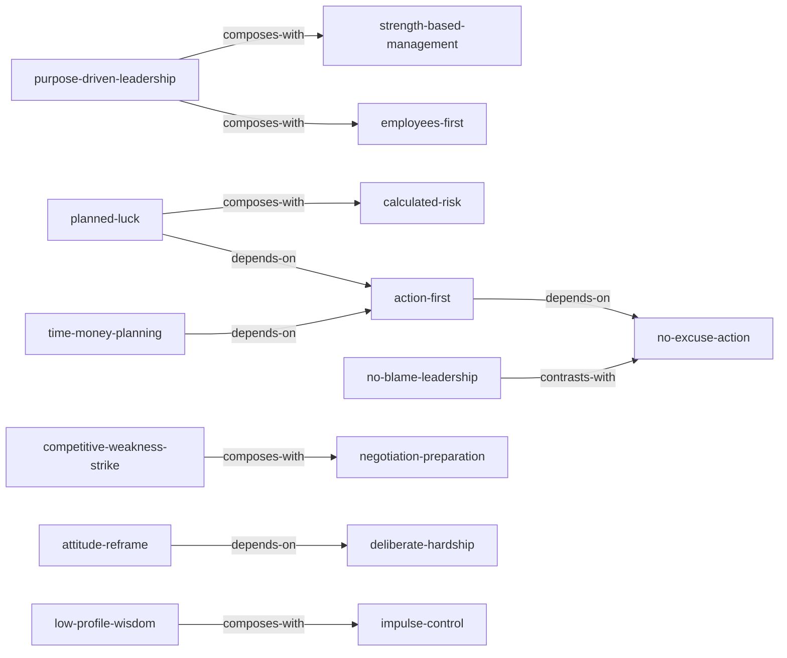

# rockefeller-38-letters-skills

由《洛克菲勒留给儿子的38封信》蒸馏出的一组**可被 AI Agent 调用的技能**（Skills）。

> 洛克菲勒用 38 封家书，向儿子传递一套从「普通人」到「财富创造者」的心智操作系统——
> 一个白手起家者如何通过态度、行动、谋略、合作与责任，持续创造财富并掌控命运的完整体系。
> 本项目把这些方法论提炼成 15 个原子化技能，让 Agent 能在真实场景里调用它们。

---

## 来源

| | |
|---|---|
| **书名** | 洛克菲勒留给儿子的38封信 |
| **作者** | 约翰·D·洛克菲勒（John D. Rockefeller） |
| **出版** | 原信写于 19 世纪末至 20 世纪初 |
| **蒸馏工具** | cangjie-skill（仓颉：把长内容蒸馏成可调用技能的流水线） |
| **蒸馏方法** | RIA-TV++（整书理解 → 并行提取 → 三重验证 → RIA++ 构造 → 链接 → 压力测试 → 交付） |

---

## 15 个技能

### 自我塑造与心态

- [`low-profile-wisdom`](skills/low-profile-wisdom/SKILL.md) — **韬光养晦**：在需要借力或避免树敌时收敛锋芒，以谦恭姿态获取更有利位置
- [`deliberate-hardship`](skills/deliberate-hardship/SKILL.md) — **主动吃苦**：有意识地选择艰难任务与挫折经历，磨砺毅力与实行能力
- [`attitude-reframe`](skills/attitude-reframe/SKILL.md) — **态度重塑**：将工作从义务或惩罚重新定义为乐趣与荣耀，改变工作体验
- [`impulse-control`](skills/impulse-control/SKILL.md) — **控制冲动决策**：在重大决策前不被情绪左右，保持冷静理性

### 行动与执行

- [`action-first`](skills/action-first/SKILL.md) — **当下行动**：在计划足够好后立即行动，用实践迭代替代完美准备
- [`no-excuse-action`](skills/no-excuse-action/SKILL.md) — **不找借口行动法**：在失败或拖延出现时切断借口链条，把注意力拉回可控行动

### 战略与机遇

- [`planned-luck`](skills/planned-luck/SKILL.md) — **策划运气**：通过明确目标与资源、制定分阶段谋略，主动创造并引导机遇出现
- [`competitive-weakness-strike`](skills/competitive-weakness-strike/SKILL.md) — **竞争七寸打击法**：正面无效时找到对手系统失效的薄弱环节并集中资源一击制胜
- [`calculated-risk`](skills/calculated-risk/SKILL.md) — **计算后的冒险**：遵循「大胆谋划、周密计划、谨慎实施」，在判断价值后果断冒险

### 领导与合作

- [`purpose-driven-leadership`](skills/purpose-driven-leadership/SKILL.md) — **目的驱动领导**：以清晰目的为行动原点，并向团队坦诚沟通以换取忠诚
- [`no-blame-leadership`](skills/no-blame-leadership/SKILL.md) — **反责难领导法**：问题发生时停止责难与抱怨，把焦点拉回自身职责与修复行动
- [`strength-based-management`](skills/strength-based-management/SKILL.md) — **长处用人法**：聚焦部属优点与特殊才能，把人放到最喜欢且最擅长的事情上
- [`employees-first`](skills/employees-first/SKILL.md) — **员工首位管理法**：通过尊重、优厚待遇、感谢与赋能，将雇员放在首位以激发最大潜能

### 谈判与财富

- [`negotiation-preparation`](skills/negotiation-preparation/SKILL.md) — **谈判备战五要素**：谈判前系统梳理市场、自身、对手、目标与态度五类信息
- [`time-money-planning`](skills/time-money-planning/SKILL.md) — **时间金钱双维计划**：把「珍惜时间和金钱」转化为目标-措施-监督三步计划

---

## 技能之间的引用关系



图例：`depends-on` 依赖 · `contrasts-with` 二选一 · `composes-with` 常配合使用

**推荐学习顺序**：`attitude-reframe` → `deliberate-hardship` → `impulse-control` → `low-profile-wisdom` → `no-excuse-action` → `action-first` → `time-money-planning` → `planned-luck` → `calculated-risk` → `negotiation-preparation` → `competitive-weakness-strike` → `purpose-driven-leadership` → `no-blame-leadership` → `strength-based-management` → `employees-first`

---

## 安装

每个技能目录都包含 `SKILL.md`（+ `test-prompts.json` 测试产物），可直接复制到宿主环境：

```bash
# Claude Code（用户级，所有项目可用）
cp -r skills/* ~/.claude/skills/

# 或 Claude Code（项目级）
cp -r skills/* <project>/.claude/skills/

# Trae（项目级）
cp -r skills/* <project>/.trae/skills/

# Cursor（项目级）
cp -r skills/* <project>/.cursor/skills/
```

---

## 完整文档

`docs/` 目录保留了完整的蒸馏产物与审计轨迹：

| 文件 | 说明 |
|---|---|
| [`DIGEST.md`](docs/DIGEST.md) | 面向读者的精华长文（不读全书看这篇，约 6000 字） |
| [`GLOSSARY.md`](docs/GLOSSARY.md) | 共享术语词典（装傻/吃苦/态度/策划运气/价值…） |
| [`INDEX.md`](docs/INDEX.md) | 技能总览 + 引用图 + 学习顺序 |
| [`BOOK_OVERVIEW.md`](docs/BOOK_OVERVIEW.md) | 整书理解（结构/解释/批判/应用潜力） |
| [`PIPELINE_STATE.md`](docs/PIPELINE_STATE.md) | 流水线各阶段状态 |
| [`candidates/`](docs/candidates/) | 4 组并行提取的原始候选池 |
| [`rejected/`](docs/rejected/) | 被淘汰的候选（含原因） |

---

## 目录结构

```text
rockefeller-38-letters-skills/
├── README.md
├── skills/                      # 15 个可安装技能（核心交付物）
│   └── <skill-slug>/
│       ├── SKILL.md             # 技能定义（R/I/A1/A2/E/B 六段）
│       └── test-prompts.json    # 触发/诱饵测试集
└── docs/                        # 蒸馏文档与审计轨迹
    ├── DIGEST.md / GLOSSARY.md / INDEX.md
    ├── BOOK_OVERVIEW.md / PIPELINE_STATE.md
    ├── candidates/              # 4 组并行提取候选
    └── rejected/                # 淘汰候选
```

---

## 关于内容与版权

本项目是**方法论蒸馏产物**，不含原书全文：

- 每个技能对原书的引用严格控制在**≤150 字/段**，属于合理引用范畴；
- 原文（洛克菲勒家书）的版权归其译者/出版社所有；
- 建议购买正版书籍配合使用。

---

## 免责声明

这些 skills 基于洛克菲勒 19 世纪末至 20 世纪初的商业哲学蒸馏而成，部分观点带有时代局限。现代商业环境涉及反垄断、劳动法、合规等复杂法律框架，请结合当代法规与伦理标准审慎使用。

---

## 如何重新生成

本项目由 cangjie-skill（仓颉蒸馏流水线）自动生成。若要复现或调整：

1. 准备书籍文本（`fulltext.txt`，从 EPUB 提取）
2. 运行 RIA-TV++ 流水线（阶段 0–5，详见 `docs/PIPELINE_STATE.md`）
3. 通过三重验证 + 压力测试的单元会被构造为独立技能并安装

如需让技能持续进化，可喂给 `darwin-skill`：`darwin evolve rockefeller-38-letters-skills/`
