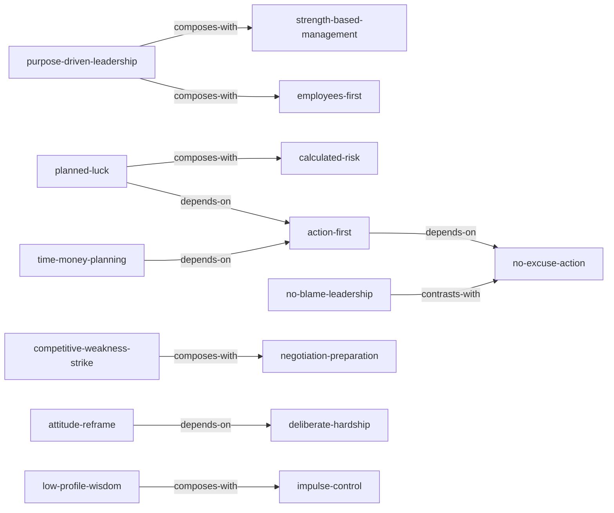

# 《洛克菲勒留给儿子的38封信》—— Skill Index

> 本书由 cangjie-skill 蒸馏，共产出 **15** 个 skills。
> 处理时间: 2026-08-20

## 关于这本书

- **作者**: 约翰·D·洛克菲勒 (John D. Rockefeller)
- **出版年**: 19 世纪末至 20 世纪初（原信）；中译本以具体版本为准
- **一句话主旨**: 一个白手起家者如何通过态度、行动、谋略、合作与责任，持续创造财富并掌控命运的完整心智体系。
- **整书理解**: 见 [BOOK_OVERVIEW.md](./BOOK_OVERVIEW.md)
- **精华长文** (不读全书看这篇): [DIGEST.md](./DIGEST.md)
- **术语词典**: [GLOSSARY.md](./GLOSSARY.md)

---

## Skill 列表 (按主题分组)

### 自我塑造与心态

- [`low-profile-wisdom`](../skills/low-profile-wisdom/SKILL.md) — 韬光养晦：在需要借力或避免树敌时收敛锋芒，以谦恭姿态获取更有利位置。
- [`deliberate-hardship`](../skills/deliberate-hardship/SKILL.md) — 主动吃苦：有意识地选择艰难任务与挫折经历，磨砺毅力与实行能力。
- [`attitude-reframe`](../skills/attitude-reframe/SKILL.md) — 态度重塑：将工作从义务或惩罚重新定义为乐趣与荣耀，改变工作体验。
- [`impulse-control`](../skills/impulse-control/SKILL.md) — 控制冲动决策：在重大决策前不被情绪左右，保持冷静理性。

### 行动与执行

- [`action-first`](../skills/action-first/SKILL.md) — 当下行动：在计划足够好后立即行动，用实践迭代替代完美准备。
- [`no-excuse-action`](../skills/no-excuse-action/SKILL.md) — 不找借口行动法：在失败或拖延出现时切断借口链条，把注意力拉回可控行动。

### 战略与机遇

- [`planned-luck`](../skills/planned-luck/SKILL.md) — 策划运气：通过明确目标与资源、制定分阶段谋略，主动创造并引导机遇出现。
- [`competitive-weakness-strike`](../skills/competitive-weakness-strike/SKILL.md) — 竞争七寸打击法：正面无效时找到对手系统失效的薄弱环节并集中资源一击制胜。
- [`calculated-risk`](../skills/calculated-risk/SKILL.md) — 计算后的冒险：遵循"大胆谋划、周密计划、谨慎实施"，在判断价值后果断冒险。

### 领导与合作

- [`purpose-driven-leadership`](../skills/purpose-driven-leadership/SKILL.md) — 目的驱动领导：以清晰目的为行动原点，并向团队坦诚沟通以换取忠诚。
- [`no-blame-leadership`](../skills/no-blame-leadership/SKILL.md) — 反责难领导法：问题发生时停止责难与抱怨，把焦点拉回自身职责与修复行动。
- [`strength-based-management`](../skills/strength-based-management/SKILL.md) — 长处用人法：聚焦部属优点与特殊才能，把人放到最喜欢且最擅长的事情上。
- [`employees-first`](../skills/employees-first/SKILL.md) — 员工首位管理法：通过尊重、优厚待遇、感谢与赋能，将雇员放在首位以激发最大潜能。

### 谈判与财富

- [`negotiation-preparation`](../skills/negotiation-preparation/SKILL.md) — 谈判备战五要素：谈判前系统梳理市场、自身、对手、目标与态度五类信息。
- [`time-money-planning`](../skills/time-money-planning/SKILL.md) — 时间金钱双维计划：把"珍惜时间和金钱"转化为目标-措施-监督三步计划。

---

## 引用图



图例:
- `-->`  depends-on
- `-.->` contrasts-with
- `===>` composes-with

---

## 推荐学习顺序

(从依赖图的叶子节点开始，向上)

1. **attitude-reframe** — 先调整对待工作与自己的态度，奠定行动基础。
2. **deliberate-hardship** — 态度之后，主动选择历练以积累实力。
3. **impulse-control** — 在行动前学会管理情绪，避免冲动毁事。
4. **low-profile-wisdom** — 实力不足时学会收敛锋芒、借力前行。
5. **no-excuse-action** — 建立结果导向思维，切断借口链条。
6. **action-first** — 把想法转化为最小行动，克服完美主义拖延。
7. **time-money-planning** — 让行动与资源使用有目标、有监督。
8. **planned-luck** — 在行动基础上，主动策划机会。
9. **calculated-risk** — 机会出现时，用计算后的冒险抓住关键转折。
10. **negotiation-preparation** — 扩大机会需要与人谈判，系统备战。
11. **competitive-weakness-strike** — 面对竞争，找到对手七寸。
12. **purpose-driven-leadership** — 事业扩大后，用目的驱动团队。
13. **no-blame-leadership** — 团队出问题后，用反责难建立责任文化。
14. **strength-based-management** — 把人放到擅长位置，释放团队产能。
15. **employees-first** — 用尊重与感激激发员工最大潜能。

---

## 安装使用

本目录是构建产物，宿主不会从这里加载 skill。要让 agent 真正调用，把 skill 目录复制到宿主的 skills 目录:

```bash
# 用户级 (所有项目可用)
cp -r e:/solo/books/rockefeller-38-letters/planned-luck ~/.trae/skills/

# 或项目级
cp -r e:/solo/books/rockefeller-38-letters/planned-luck <project>/.trae/skills/
```

---

## 接入 darwin-skill

所有 skill 均带有 `test-prompts.json` (darwin-skill 兼容格式)，可直接接入自动进化:

```bash
darwin evolve books/rockefeller-38-letters/
```

---

## 审计轨迹

- 候选单元池: [candidates/](./candidates/)
- 被淘汰的候选 (含原因): [rejected/](./rejected/)
- BOOK_OVERVIEW: [BOOK_OVERVIEW.md](./BOOK_OVERVIEW.md)
