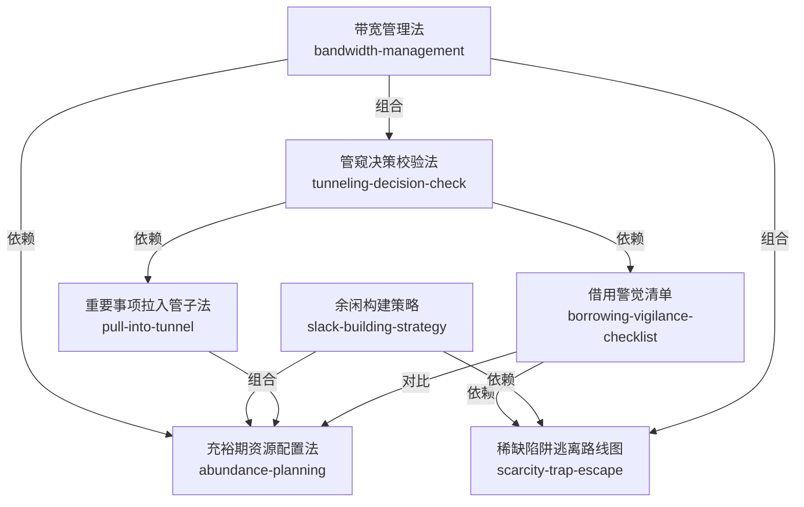

# 稀缺（Scarcity）· 技能集

由塞德希尔·穆来纳森 & 埃尔德·沙菲尔《稀缺：我们是如何陷入贫穷与忙碌的》蒸馏出的一组**可被 AI Agent 调用的技能**（Skills）。

> 稀缺会俘获大脑，造成管窥心态和带宽负担，通过借用、杂耍等行为自我强化，形成难以逃脱的陷阱。
> 本书揭示稀缺的内在逻辑——不是「人不够努力」，而是「视野被自动收窄、带宽被持续消耗」，
> 并给出应对方向：**不是靠意志力，而是靠设计**。本项目把这些方法论提炼成 7 个原子化技能。

---

## 来源

| | |
|---|---|
| **书名** | 稀缺：我们是如何陷入贫穷与忙碌的（新版）*Scarcity: Why Having Too Little Means So Much* |
| **作者** | 塞德希尔·穆来纳森（Sendhil Mullainathan）& 埃尔德·沙菲尔（Eldar Shafir） |
| **出版** | 2022（新版）/ 原版约 2013 |
| **蒸馏工具** | cangjie-skill（仓颉：把长内容蒸馏成可调用技能的流水线） |
| **蒸馏方法** | RIA-TV++（整书理解 → 并行提取 → 三重验证 → RIA++ 构造 → 链接 → 压力测试 → 交付） |

---

## 7 个技能

### 基础理论层（理解稀缺机制）

- [`bandwidth-management`](skills/bandwidth-management/SKILL.md) — **带宽管理法**：像管理时间和金钱一样管理心智带宽（Ch2，核心概念入口）
- [`tunneling-decision-check`](skills/tunneling-decision-check/SKILL.md) — **管窥决策校验法**：稀缺状态下做决策时，主动检查「管子外面」的盲区（Ch1，最具颠覆性的洞见）

### 单工具层（应对特定问题）

- [`borrowing-vigilance-checklist`](skills/borrowing-vigilance-checklist/SKILL.md) — **借用警觉清单**：想借钱/拖延时，强制检查真实代价（Ch5–6）
- [`pull-into-tunnel`](skills/pull-into-tunnel/SKILL.md) — **重要事项拉入管子法**：通过设计让重要但不紧急的事不被忽略（Ch8、Ch10）
- [`slack-building-strategy`](skills/slack-building-strategy/SKILL.md) — **余闲构建策略**：主动预留缓冲资源，避免落入稀缺陷阱（Ch3、Ch9）
- [`abundance-planning`](skills/abundance-planning/SKILL.md) — **充裕期资源配置法**：在带宽充裕时提前锁定，为稀缺期做准备（Ch6、Ch10）

### 综合方案层（系统性解决方案）

- [`scarcity-trap-escape`](skills/scarcity-trap-escape/SKILL.md) — **稀缺陷阱逃离路线图**：分五步逃离恶性循环：止血→建缓冲→解根源→巩固（Ch6–7）

---

## 技能之间的引用关系



图例：实线 = 依赖关系（被依赖 → 依赖者）· 无方向连线 = 组合关系（常配合使用）

**推荐学习顺序**（从基础到应用）：`bandwidth-management` → `tunneling-decision-check` → `borrowing-vigilance-checklist` → `pull-into-tunnel` → `slack-building-strategy` → `abundance-planning` → `scarcity-trap-escape`

**快速决策指南**：

| 你的问题 | 调用哪个 Skill |
|---|---|
| 忙中出错、顾此失彼 | `tunneling-decision-check` |
| 脑子不够用、状态差 | `bandwidth-management` |
| 想借钱/想拖延、觉得「先渡难关」 | `borrowing-vigilance-checklist` |
| 知道重要但总是忘了做 | `pull-into-tunnel` |
| 日程排满、一个意外就全乱 | `slack-building-strategy` |
| 月初有钱月底光/前期摸鱼后期熬夜 | `abundance-planning` |
| 越忙越穷、恶性循环、走不出来 | `scarcity-trap-escape` |

---

## 安装

每个技能目录都包含 `SKILL.md`（+ `test-prompts.json` / `test-results.md` 测试产物），可直接复制到宿主环境：

```bash
# Claude Code（用户级，所有项目可用）
cp -r skills/* ~/.claude/skills/

# 或 Claude Code（项目级）
cp -r skills/* <project>/.claude/skills/

# Trae（项目级）
cp -r skills/* <project>/.trae/skills/

# Cursor（项目级）
cp -r skills/* <project>/.cursor/skills/
```

---

## 完整文档

`docs/` 目录保留了完整的蒸馏产物与审计轨迹：

| 文件 | 说明 |
|---|---|
| [`DIGEST.md`](docs/DIGEST.md) | 面向读者的精华长文（不读全书看这篇，约 8000 字） |
| [`GLOSSARY.md`](docs/GLOSSARY.md) | 共享术语词典（稀缺/管窥/带宽/余闲/借用…） |
| [`INDEX.md`](docs/INDEX.md) | 技能总览 + 引用图 + 学习顺序 |
| [`BOOK_OVERVIEW.md`](docs/BOOK_OVERVIEW.md) | 整书理解（结构/解释/批判/应用潜力） |
| [`verified.md`](docs/verified.md) | 三重验证结果（候选池 → 7 通过） |
| [`PIPELINE_STATE.md`](docs/PIPELINE_STATE.md) | 流水线各阶段状态 |
| [`rejected.md`](docs/rejected.md) | 淘汰候选及原因 |
| [`candidates/`](docs/candidates/) | 5 个提取器的原始候选池（框架/原则/案例/反例/术语） |

---

## 目录结构

```text
scarcity/
├── README.md
├── skills/                      # 7 个可安装技能（核心交付物）
│   └── <skill-slug>/
│       ├── SKILL.md             # 技能定义（R/I/A1/A2/E/B 六段）
│       ├── test-prompts.json    # 触发/诱饵测试集
│       └── test-results.md      # 压力测试结果
└── docs/                        # 蒸馏文档与审计轨迹
    ├── DIGEST.md / GLOSSARY.md / INDEX.md
    ├── BOOK_OVERVIEW.md / verified.md / PIPELINE_STATE.md
    ├── rejected.md
    └── candidates/              # 框架/原则/案例/反例/术语 候选池
```

---

## 关于内容与版权

本项目是**方法论蒸馏产物**，不含原书全文：

- 每个技能对原书的引用严格控制在 **≤150 字/段**，属于合理引用范畴；
- 原文的版权归原作者塞德希尔·穆来纳森、埃尔德·沙菲尔及出版社所有；
- 建议购买正版书籍配合使用。

---

## 如何重新生成

本项目由 cangjie-skill（仓颉蒸馏流水线）自动生成。若要复现或调整：

1. 准备书籍文本（`fulltext.txt`）
2. 运行 RIA-TV++ 流水线（阶段 0–5，详见 `docs/PIPELINE_STATE.md`）
3. 通过三重验证 + 压力测试的单元会被构造为独立技能并安装

如需让技能持续进化，可喂给 `darwin-skill`：`darwin evolve scarcity/`
