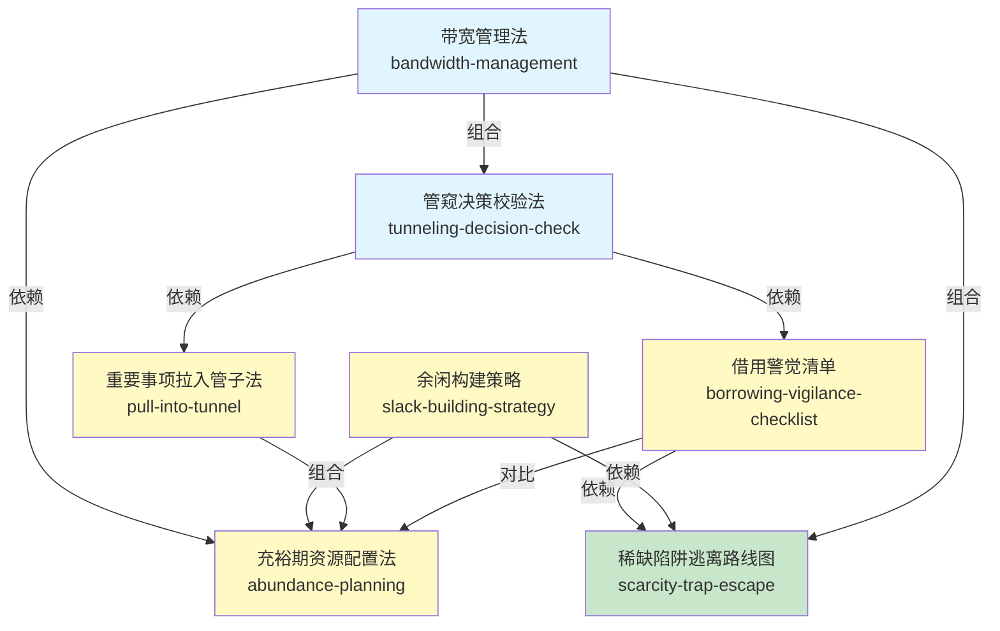

# 《稀缺》技能网络 (INDEX)

> 阶段 3 产出 · Zettelkasten 链接
> 7 个可执行技能 + 术语词典 + 引用图

---

## 📖 书籍信息

- **书名**: 稀缺：我们是如何陷入贫穷与忙碌的（新版）
- **作者**: 塞德希尔·穆来纳森（Sendhil Mullainathan）& 埃尔德·沙菲尔（Eldar Shafir）
- **出版时间**: 2022年10月（新版，原版约2013年）
- **一句话主旨**: 稀缺会俘获大脑，造成管窥心态和带宽负担，通过借用、杂耍等行为自我强化，形成难以逃脱的陷阱；理解稀缺的内在逻辑，可以通过设计而非意志力来应对。

---

## 🧩 技能总览（7个）

### 基础理论层（理解稀缺机制）

| 技能 | 一句话说明 | 核心概念 |
|---|---|---|
| [带宽管理法](../skills/bandwidth-management/SKILL.md) | 像管理时间和金钱一样管理心智带宽 | 带宽 / 流体智力 / 执行控制力 |
| [管窥决策校验法](../skills/tunneling-decision-check/SKILL.md) | 稀缺状态下做决策时，主动检查"管子外面"的盲区 | 管窥 / 目标抑制 / 注意力窄化 |

### 单工具层（应对特定问题）

| 技能 | 一句话说明 | 核心概念 |
|---|---|---|
| [借用警觉清单](../skills/borrowing-vigilance-checklist/SKILL.md) | 想借钱/拖延时，强制检查真实代价 | 借用 / 复利陷阱 / 短视 |
| [重要事项拉入管子法](../skills/pull-into-tunnel/SKILL.md) | 通过设计让重要但不紧急的事不被忽略 | 提醒 / 默认选项 / 一次性行动 |
| [余闲构建策略](../skills/slack-building-strategy/SKILL.md) | 主动预留缓冲资源，避免落入稀缺陷阱 | 余闲 / 缓冲 / 系统弹性 |
| [充裕期资源配置法](../skills/abundance-planning/SKILL.md) | 在带宽充裕时提前锁定，为稀缺期做准备 | 充裕-稀缺循环 / 时机选择 |

### 综合方案层（系统性解决方案）

| 技能 | 一句话说明 | 核心概念 |
|---|---|---|
| [稀缺陷阱逃离路线图](../skills/scarcity-trap-escape/SKILL.md) | 分五步逃离恶性循环：止血→建缓冲→解根源→巩固 | 稀缺陷阱 / 杂耍 / 正循环 |

---

## 🔗 引用图

**图例**:
- 🔵 蓝色 = 基础理论层
- 🟡 黄色 = 单工具层
- 🟢 绿色 = 综合方案层
- 箭头 = 依赖关系（被依赖 → 依赖者）
- 无方向连线 = 组合关系（常配合使用）

---

## 📚 推荐学习顺序

### 入门路径（从基础到应用）

1. **带宽管理法** — 理解最核心的概念：心智带宽是有限资源，稀缺会消耗它。
   这是理解所有其他技能的基础。

2. **管窥决策校验法** — 理解稀缺如何改变注意力：不是"不努力"，
   而是视野自动变窄。这是最具颠覆性的洞见。

3. **借用警觉清单** — 第一个可立即使用的工具：下次想借钱/拖延时，
   用这个清单检查一下真实代价。

4. **重要事项拉入管子法** — 从"为什么做不到"到"怎么才能做到"：
   不靠意志力，靠设计。

5. **余闲构建策略** — 从被动应对到主动预防：为什么"留余量"不是浪费，
   而是最高效的投资。

6. **充裕期资源配置法** — 时机的艺术：在状态最好的时候做最重要的事，
   而不是等状态差了再挣扎。

7. **稀缺陷阱逃离路线图** — 如果你已经陷入恶性循环，这是完整的脱困指南。
   需要前面几个工具的配合使用。

### 快速应用路径（根据问题选工具）

| 你的问题 | 直接用这个 skill |
|---|---|
| 忙中出错、顾此失彼 | 管窥决策校验法 |
| 脑子不够用、状态差 | 带宽管理法 |
| 想借钱/想拖延、觉得"先渡难关" | 借用警觉清单 |
| 知道重要但总是忘了做 | 重要事项拉入管子法 |
| 日程排满、一个意外就全乱 | 余闲构建策略 |
| 月初有钱月底光/前期摸鱼后期熬夜 | 充裕期资源配置法 |
| 越忙越穷、恶性循环、走不出来 | 稀缺陷阱逃离路线图 |

---

## 📖 共享术语词典

所有技能共用的核心术语定义，见 [GLOSSARY.md](GLOSSARY.md)

---

## 📊 技能关系统计

| 关系类型 | 数量 |
|---|---|
| 依赖 (depends-on) | 5 条 |
| 组合 (composes-with) | 5 条 |
| 对比 (contrasts-with) | 1 条 |
| **合计** | **11 条** |

平均每个技能约 3 条关系，符合"既不孤立也不过度连接"的健康网络结构。
