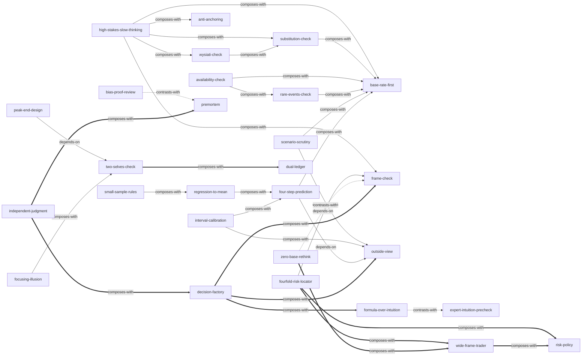

# 思考，快与慢

由《思考，快与慢（第二版）》（*Thinking, Fast and Slow*）蒸馏出的一组**可被 AI Agent 调用的技能**（Skills）。

> 判断与选择由爱编故事的快速直觉（系统1）主导，负责怀疑与统计的慢思考（系统2）天性懒惰，
> 因此错误是系统性、可预测的。本书提供诊断词汇与程序性纠偏工具，并承认个人自纠近乎无解、改善主要靠组织与制度。
> 本项目把卡尼曼的偏差工具箱提炼成 28 个原子化技能，让 Agent 能在真实判断与决策场景里调用它们。

---

## 来源

| | |
|---|---|
| **书名** | 思考，快与慢（第二版）（*Thinking, Fast and Slow, 2nd Edition*） |
| **作者** | 丹尼尔·卡尼曼（Daniel Kahneman）· 审校：赵佳颖 |
| **出版** | 中信出版社 2025（原书 2011） |
| **蒸馏工具** | cangjie-skill（仓颉：把长内容蒸馏成可调用技能的流水线） |
| **蒸馏方法** | RIA-TV++（整书理解 → 并行提取 → 三重验证 → RIA++ 构造 → 链接 → 压力测试 → 交付） |

---

## 28 个技能

### 元认知总闸（先判断要不要慢下来）

- [`high-stakes-slow-thinking`](skills/high-stakes-slow-thinking/SKILL.md) — **雷区识别与选择性慢思考**：平时放行直觉，只在雷区迹象出现时切换慢思考
- [`substitution-check`](skills/substitution-check/SKILL.md) — **替代自检**：作答后回看「我刚才实际回答的是哪个问题」
- [`wysiati-check`](skills/wysiati-check/SKILL.md) — **WYSIATI 怀疑信号**：越顺越要停，三问 + 反向证据

### 判断与概率

- [`anti-anchoring`](skills/anti-anchoring/SKILL.md) — **反锚定程序**：任何公开的数字都在锚定你
- [`availability-check`](skills/availability-check/SKILL.md) — **可得性自检两问**：例子是怎么进脑子的
- [`base-rate-first`](skills/base-rate-first/SKILL.md) — **贝叶斯纪律**：锚定基率 + 质疑证据诊断力
- [`scenario-scrutiny`](skills/scenario-scrutiny/SKILL.md) — **情景细节审查**：越丰富越可信、也越不可能
- [`rare-events-check`](skills/rare-events-check/SKILL.md) — **罕见事件与概率表述去偏**：加总 =100% + 双向换算

### 统计与归因

- [`small-sample-rules`](skills/small-sample-rules/SKILL.md) — **小数定律与运气优先归因**
- [`regression-to-mean`](skills/regression-to-mean/SKILL.md) — **回归均值与奖惩错觉**：有解释，但没有原因

### 预测与评估

- [`four-step-prediction`](skills/four-step-prediction/SKILL.md) — **四步回归纠偏**：基线 → 直觉 → 相关性 → 收缩
- [`interval-calibration`](skills/interval-calibration/SKILL.md) — **置信区间校准**：按历史意外率放宽
- [`bias-proof-review`](skills/bias-proof-review/SKILL.md) — **复盘去偏**：过程/结果分开评分 +「知道」的纪律
- [`formula-over-intuition`](skills/formula-over-intuition/SKILL.md) — **低效度环境交公式**：等权重 + 断腿法则
- [`expert-intuition-precheck`](skills/expert-intuition-precheck/SKILL.md) — **专家直觉可信度预检**：两条件 + 一禁令
- [`outside-view`](skills/outside-view/SKILL.md) — **外部视角/参考类别预测**：先查同类分布
- [`premortem`](skills/premortem/SKILL.md) — **事前验尸**：假想「计划已失败」写灾难简史

### 风险与金钱

- [`fourfold-risk-locator`](skills/fourfold-risk-locator/SKILL.md) — **四重模式定位器**：损益×概率四格 + 止损警报
- [`frame-check`](skills/frame-check/SKILL.md) — **框架检验**：换一种说法再答一遍
- [`zero-base-rethink`](skills/zero-base-rethink/SKILL.md) — **零基重估**：今天按市价还会买吗
- [`wide-frame-trader`](skills/wide-frame-trader/SKILL.md) — **宽框架/交易者思维**：同类第 N 次决策之一
- [`risk-policy`](skills/risk-policy/SKILL.md) — **风险政策**：一次立法、终身执行

### 幸福与体验

- [`peak-end-design`](skills/peak-end-design/SKILL.md) — **峰终设计**：先声明为哪个自我优化
- [`two-selves-check`](skills/two-selves-check/SKILL.md) — **双自我决策核查**：体验自我/记忆自我 + 时长分量 + 预期后悔
- [`focusing-illusion`](skills/focusing-illusion/SKILL.md) — **聚焦错觉纠偏**：你会花多少时间想到它
- [`dual-ledger`](skills/dual-ledger/SKILL.md) — **双测量评估**：体验幸福与生活评价分开排序

### 群体与组织

- [`independent-judgment`](skills/independent-judgment/SKILL.md) — **独立判断程序**：先写后议、横向批改、信息源隔离
- [`decision-factory`](skills/decision-factory/SKILL.md) — **决策工厂**：三环节 + 四件套 + 偏差词汇文化

---

## 技能之间的引用关系



图例：`-->` 依赖 · `-.->` 二选一 · `===>` 常组合使用

**推荐学习顺序**：`substitution-check` → `wysiati-check` → `base-rate-first` → `availability-check` / `scenario-scrutiny` / `rare-events-check` → `anti-anchoring` → `high-stakes-slow-thinking` → `small-sample-rules` → `regression-to-mean` → `outside-view` → `four-step-prediction` → `interval-calibration` → `expert-intuition-precheck` ↔ `formula-over-intuition` → `premortem` ↔ `bias-proof-review` → `frame-check` → `fourfold-risk-locator` → `wide-frame-trader` / `risk-policy` / `zero-base-rethink` → `two-selves-check` → `peak-end-design` / `focusing-illusion` / `dual-ledger` → `independent-judgment` → `decision-factory`

---

## 安装

每个技能目录都包含 `SKILL.md`（+ `test-prompts.json` 测试产物），可直接复制到宿主环境：

```bash
# Claude Code（用户级，所有项目可用）
cp -r skills/* ~/.claude/skills/

# 或 Claude Code（项目级）
cp -r skills/* <project>/.claude/skills/

# Trae（项目级）
cp -r skills/* <project>/.trae/skills/

# Cursor（项目级）
cp -r skills/* <project>/.cursor/skills/
```

---

## 完整文档

`docs/` 目录保留了完整的蒸馏产物与审计轨迹：

| 文件 | 说明 |
|---|---|
| [`DIGEST.md`](docs/DIGEST.md) | 面向读者的精华长文（不读全书看这篇，约 6500 字） |
| [`GLOSSARY.md`](docs/GLOSSARY.md) | 45 条共享术语词典（卡尼曼用法 ≠ 字典义） |
| [`INDEX.md`](docs/INDEX.md) | 技能总览 + 引用图 + 学习顺序 |
| [`BOOK_OVERVIEW.md`](docs/BOOK_OVERVIEW.md) | 整书理解（结构/解释/批判/应用潜力） |
| [`verified.md`](docs/verified.md) | 三重验证结果（155 候选 → 28 通过） |
| [`test-results.md`](docs/test-results.md) | 压力测试审计（两批 189 条盲测，100% 通过） |
| [`PIPELINE_STATE.md`](docs/PIPELINE_STATE.md) | 流水线各阶段状态与降级决策 |
| [`candidates/`](docs/candidates/) | 5 路提取的原始候选池（框架/原则/案例/反例/术语） |
| [`rejected/`](docs/rejected/) | 被淘汰候选的去向与死因 |

---

## 目录结构

```text
thinking-fast-and-slow/
├── README.md
├── skills/                      # 28 个可安装技能（核心交付物）
│   └── <skill-slug>/
│       ├── SKILL.md             # 技能定义（R/I/A1/A2/E/B 六段）
│       └── test-prompts.json    # 触发/诱饵测试集
└── docs/                        # 蒸馏文档与审计轨迹
    ├── DIGEST.md / GLOSSARY.md / INDEX.md
    ├── BOOK_OVERVIEW.md / verified.md / test-results.md
    ├── PIPELINE_STATE.md
    ├── candidates/              # 框架/原则/案例/反例/术语 候选池
    └── rejected/                # 淘汰候选及原因
```

---

## 关于内容与版权

本项目是**方法论蒸馏产物**，不含原书全文：

- 每个技能对原书的引用严格控制在**≤150 字/段**，属于评论与研究目的的合理引用范畴；
- 原文的版权归原作者丹尼尔·卡尼曼及中信出版社所有；
- 建议购买正版书籍配合使用。

---

## 如何重新生成

本项目由 cangjie-skill（仓颉蒸馏流水线）自动生成。若要复现或调整：

1. 准备书籍文本（从 EPUB 抽取为 `source/` 逐章 txt，`extract_epub.py` 可重跑）
2. 运行 RIA-TV++ 流水线（阶段 0–7，详见 `docs/PIPELINE_STATE.md`）
3. 通过三重验证 + 盲测的单元会被构造为独立技能并安装

如需让技能持续进化，可喂给 `darwin-skill`：`darwin evolve thinking-fast-and-slow/`
