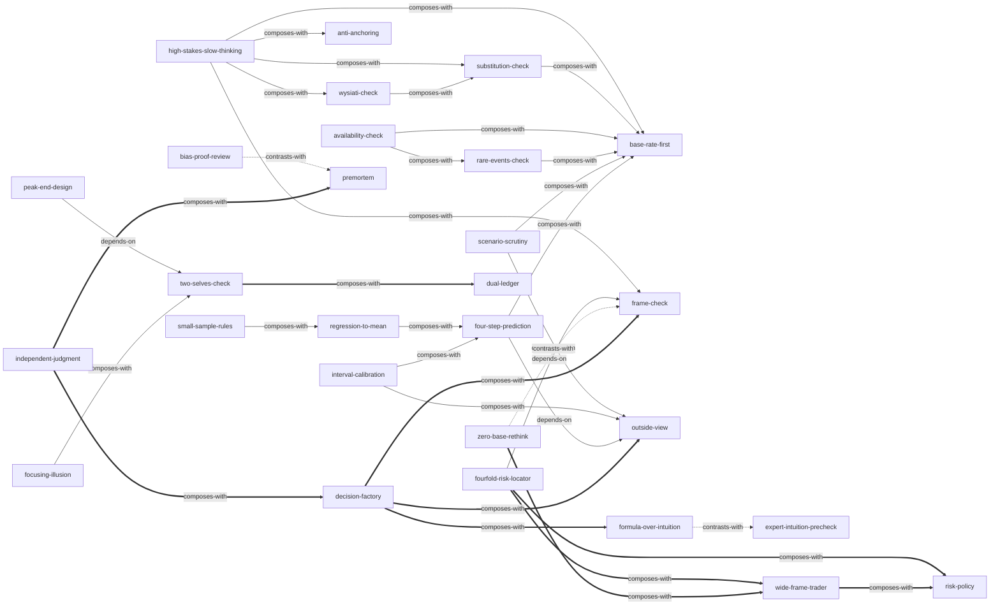

# 思考，快与慢（第二版） — Skill Index

> 本书由 cangjie-skill 蒸馏，共产出 **28** 个 skills（verified.md 的 28 个验证单元全部建成）。
> 处理时间: 2026-09-04（首批 15 个）/ 2026-09-05（补齐 13 个）

## 关于这本书

- **作者**: [美] 丹尼尔·卡尼曼（Daniel Kahneman）；赵佳颖 审校
- **出版年**: 中信出版社 2025（原书 2011）
- **一句话主旨**: 判断与选择由爱编故事的快速直觉（系统1）主导，负责怀疑与统计的慢思考（系统2）天性懒惰，因此错误是系统性、可预测的——本书提供诊断词汇与程序性纠偏工具，并承认个人自纠近乎无解、改善主要靠组织与制度。
- **整书理解**: [BOOK_OVERVIEW.md](./BOOK_OVERVIEW.md)
- **精华长文** (不读全书看这篇): [DIGEST.md](./DIGEST.md)
- **术语词典**: [GLOSSARY.md](./GLOSSARY.md)
- **三重验证记录**: [verified.md](./verified.md) / 淘汰与去向: [rejected/_index.md](./rejected/_index.md)

---

## Skill 列表 (按主题分组)

### 元认知总闸（先判断要不要慢下来）

- [`high-stakes-slow-thinking`](../skills/high-stakes-slow-thinking/SKILL.md) — 雷区识别与选择性慢思考：平时放行直觉，只在雷区迹象出现时切换慢思考
- [`substitution-check`](../skills/substitution-check/SKILL.md) — 替代自检：作答后回看"我刚才实际回答的是哪个问题"
- [`wysiati-check`](../skills/wysiati-check/SKILL.md) — WYSIATI 怀疑信号：越顺越要停，三问+反向证据

### 判断与概率

- [`anti-anchoring`](../skills/anti-anchoring/SKILL.md) — 反锚定程序：任何公开的数字都在锚定你
- [`availability-check`](../skills/availability-check/SKILL.md) — 可得性自检两问：例子是怎么进脑子的
- [`base-rate-first`](../skills/base-rate-first/SKILL.md) — 贝叶斯纪律：锚定基率+质疑证据诊断力
- [`scenario-scrutiny`](../skills/scenario-scrutiny/SKILL.md) — 情景细节审查：越丰富越可信、也越不可能
- [`rare-events-check`](../skills/rare-events-check/SKILL.md) — 罕见事件与概率表述去偏：加总=100%+双向换算

### 统计与归因

- [`small-sample-rules`](../skills/small-sample-rules/SKILL.md) — 小数定律与运气优先归因
- [`regression-to-mean`](../skills/regression-to-mean/SKILL.md) — 回归均值与奖惩错觉：有解释，但没有原因

### 预测与评估

- [`four-step-prediction`](../skills/four-step-prediction/SKILL.md) — 四步回归纠偏：基线→直觉→相关性→收缩
- [`interval-calibration`](../skills/interval-calibration/SKILL.md) — 置信区间校准：按历史意外率放宽
- [`bias-proof-review`](../skills/bias-proof-review/SKILL.md) — 复盘去偏：过程/结果分开评分+"知道"的纪律
- [`formula-over-intuition`](../skills/formula-over-intuition/SKILL.md) — 低效度环境交公式：等权重+断腿法则
- [`expert-intuition-precheck`](../skills/expert-intuition-precheck/SKILL.md) — 专家直觉可信度预检：两条件+一禁令
- [`outside-view`](../skills/outside-view/SKILL.md) — 外部视角/参考类别预测：先查同类分布
- [`premortem`](../skills/premortem/SKILL.md) — 事前验尸：假想"计划已失败"写灾难简史

### 风险与金钱

- [`fourfold-risk-locator`](../skills/fourfold-risk-locator/SKILL.md) — 四重模式定位器：损益×概率四格+止损警报
- [`frame-check`](../skills/frame-check/SKILL.md) — 框架检验：换一种说法再答一遍
- [`zero-base-rethink`](../skills/zero-base-rethink/SKILL.md) — 零基重估：今天按市价还会买吗
- [`wide-frame-trader`](../skills/wide-frame-trader/SKILL.md) — 宽框架/交易者思维：同类第N次决策之一
- [`risk-policy`](../skills/risk-policy/SKILL.md) — 风险政策：一次立法、终身执行

### 幸福与体验

- [`peak-end-design`](../skills/peak-end-design/SKILL.md) — 峰终设计：先声明为哪个自我优化
- [`two-selves-check`](../skills/two-selves-check/SKILL.md) — 双自我决策核查：体验自我/记忆自我+时长分量+预期后悔
- [`focusing-illusion`](../skills/focusing-illusion/SKILL.md) — 聚焦错觉纠偏：你会花多少时间想到它
- [`dual-ledger`](../skills/dual-ledger/SKILL.md) — 双测量评估：体验幸福与生活评价分开排序

### 群体与组织

- [`independent-judgment`](../skills/independent-judgment/SKILL.md) — 独立判断程序：先写后议、横向批改、信息源隔离
- [`decision-factory`](../skills/decision-factory/SKILL.md) — 决策工厂：三环节+四件套+偏差词汇文化

---

## 引用图



图例: `-->` depends-on / `-.->` contrasts-with / `===>` composes-with
（frontmatter 共 43 条关系——depends-on 3、contrasts-with 7、composes-with 33，其中部分为双向互指；上图去重后为 38 条边。密度约 1.5 条/skill，未硬造。）

---

## 推荐学习顺序

(从依赖图的叶子节点开始，向上)

1. **substitution-check** — 最基础的元认知动作
2. **wysiati-check** — 与之配对的信息面自检
3. **base-rate-first** → **availability-check** / **scenario-scrutiny** / **rare-events-check** — 统计判断组合
4. **anti-anchoring** — 独立可用的高频工具
5. **high-stakes-slow-thinking** — 总闸：把以上工具组织成决策流程
6. **small-sample-rules** → **regression-to-mean** — 归因纪律对
7. **outside-view** → **four-step-prediction** → **interval-calibration** — 预测三连
8. **expert-intuition-precheck** ↔ **formula-over-intuition** — 对偶，成对学习
9. **premortem** ↔ **bias-proof-review** — 事前/事后对
10. **frame-check** → **fourfold-risk-locator** → **wide-frame-trader** / **risk-policy** / **zero-base-rethink** — 风险与金钱链
11. **two-selves-check** → **peak-end-design** / **focusing-illusion** / **dual-ledger** — 幸福与体验组
12. **independent-judgment** → **decision-factory** — 组织层装配线

---

## 安装使用

本目录是构建产物，宿主不会从这里加载 skill。要让 agent 真正调用，把 skill 目录复制到宿主的 skills 目录：

```bash
# ZCode 用户级（所有项目可用）
cp -r <skill-slug>/ ~/.zcode/skills/

# Claude Code
cp -r <skill-slug>/ ~/.claude/skills/
```

一次性全装 28 个（bash）：

```bash
for d in high-stakes-slow-thinking substitution-check wysiati-check anti-anchoring base-rate-first availability-check scenario-scrutiny rare-events-check small-sample-rules regression-to-mean four-step-prediction interval-calibration bias-proof-review formula-over-intuition expert-intuition-precheck outside-view premortem fourfold-risk-locator frame-check zero-base-rethink wide-frame-trader risk-policy peak-end-design two-selves-check focusing-illusion dual-ledger independent-judgment decision-factory; do
  cp -r "$d" ~/.zcode/skills/
done
```

---

## 接入 darwin-skill

所有 skill 均带有 `test-prompts.json`（darwin-skill 兼容格式），可直接接入自动进化：

```
darwin evolve books/thinking-fast-and-slow/
```

---

## 审计轨迹

- 候选单元池: [candidates/](./candidates/)（框架57 / 原则98 / 反例70 / 案例72 / 术语45）
- 被淘汰的候选（含原因）: [rejected/_index.md](./rejected/_index.md)
- 整书理解: [BOOK_OVERVIEW.md](./BOOK_OVERVIEW.md)
- 压力测试: [test-results.md](./test-results.md)（两批共 189 条）
- 流水线状态: [PIPELINE_STATE.md](./PIPELINE_STATE.md)
